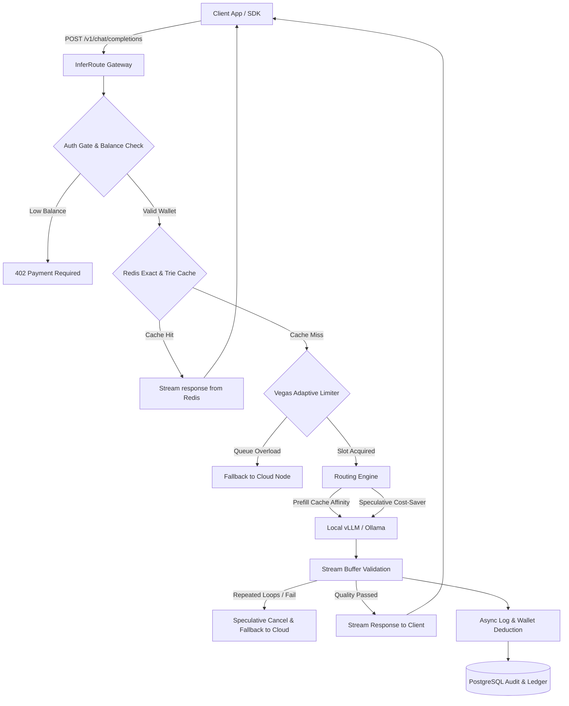

# 🎯 InferRoute: Enterprise LLM Inference Router & Observability Gateway

<p align="center">
  
  
  
  
  
</p>

---

## 📖 Introduction

> [!IMPORTANT]
> **InferRoute is NOT a Chatbot application.** It is a high-performance **LLM Inference Gateway** and reliability proxy layer designed to sit between client applications/AI agents and backend model engines (like local vLLM/Ollama and commercial OpenAI/Gemini APIs).

Rather than statically pinning your application to a single expensive cloud endpoint, InferRoute dynamically routes prompts based on **real-time quality validation, cost constraints, latency tracking, and warm KV-cache affinity**, automatically saving up to **60%+ in API costs** while protecting SLAs.

---

## ⚡ Key Technical Highlights

InferRoute is built for high-throughput, sub-millisecond overhead, and self-healing reliability. It features:

### 1. 🔄 Distributed Streaming request Deduplication
* **The Problem**: High-concurrency AI systems frequently experience "Cache Stampede" when multiple users query the exact same long prompt concurrently, causing redundant expensive model invocations.
* **Our Solution**: Implemented a distributed lock mechanism using Redis. When duplicate requests arrive at the same millisecond, only the first caller invokes the LLM. Subsequent callers automatically subscribe to the first caller's stream via **Redis Pub/Sub**, broadcasting token chunks simultaneously with zero duplicate API fees.

### 2. 🌳 Radix Trie-Based KV-Cache Affinity Routing
* **The Problem**: Pre-filling long prompts (e.g., system prompts, RAG documents) takes up to 80% of LLM inference latency. Routing queries randomly negates the performance benefits of local KV caches.
* **Our Solution**: Implemented an in-memory **Radix Trie (Prefix Tree)** matching engine. By hashing and tracking prompt prefixes, the router identifies which local GPU node holds the warm KV cache and prioritizes routing queries to that specific node, reducing **首字延迟 (TTFT) by up to 80%**.

### 3. 🛡️ Vegas-Style Adaptive Concurrency Control
* **The Problem**: Static rate limits (QPS/RPM) fail to protect local GPU engines from Out-Of-Memory (OOM) failures under sudden spikes.
* **Our Solution**: Implemented a dynamic feedback-loop rate limiter based on the **TCP Vegas congestion control algorithm**. By dynamically tracking RTT delays and queuing sizes, the gateway auto-scales its concurrent slots to prevent GPU congestion, failing-over to cloud backups dynamically when overloaded.

### 4. 🔀 Speculative Fallback Cascading & Quality Checks
* **The Problem**: Cheap local models are fast and free, but prone to formatting failures, infinite loops, or repetitive garbage outputs.
* **Our Solution**: Integrates a stream-buffering validator. It inspects the first few tokens of cheap local model outputs. If a repetitive pattern is detected, it triggers **instant speculative cancellation** and transparently cascades the request to high-quality cloud models (e.g., GPT-4o) in the middle of the request lifecycle, ensuring zero service disruption.

### 5. 💳 Multi-Tenant Billing & Simulated Wallet
* Built-in multi-tenant isolation with token-cost calculation.
* Enforces **`402 Payment Required`** block instantly if a tenant's wallet credit drains to `$0.00`, with a resilient **Fail-Open** mechanism to guarantee uptime if the database is unreachable.

---

## 🎨 Interactive Playground & Chaos Simulator

InferRoute includes a built-in interactive control center panel served at the root (`/`) path:

* **Live Cost Dashboard**: Displays money saved ($ USD), tokens saved, TTFT latency, and Redis cache hit rate.
* **Request Pipeline Visualizer**: Renders a vertical stepper showing step-by-step processing of the query (Cache checking, Limiter checking, Node executing, and Cascades).
* **Simulated Wallet & Recharge**: Top-right wallet indicator showing current credits (e.g., `$5.00` trial credit) with a simulated `+ $10` recharge button.
* **Chaos Engineering & Failure Injection**: A panel to manually kill or throttle model nodes, observing the circuit-breaker turning Red and routing self-healing in real-time.

For detailed performance, concurrency, and cost reports under heavy loads, check out the **[Benchmark Report](file:///c:/Users/pengy/OneDrive/Desktop/InferRoute/docs/benchmark.md)**.

---

## 🏗️ Architecture Design



---

## 🚀 Quick Start (Running Offline in 10 Seconds)

InferRoute features a built-in **Simulation Mode** (using SQLite and Mock adapters) allowing you to boot and explore the gateway **completely for free, offline, with zero real API keys**!

### 1. Requirements
* Python 3.12 or 3.13
* Docker & Docker Compose (Optional, for production Postgres/Redis/Grafana observability)

### 2. Installation
```bash
# Clone the repository
git clone https://github.com/ypeng12/InferRoute.git
cd InferRoute

# Initialize virtual environment
python -m venv .venv
source .venv/bin/activate  # On Windows: .venv\Scripts\activate

# Install dependencies
pip install -r requirements.txt
```

### 3. Create Local Config File
Create a `.env` file in the root directory:
```env
DATABASE_URL=sqlite+aiosqlite:///inferroute.db
MOCK_OPENAI=true
MOCK_GEMINI=true
MOCK_VLLM=true
MOCK_OLLAMA=true
```

### 4. Start the Gateway
```bash
python -m uvicorn inferroute.main:app --host 127.0.0.1 --port 8080 --reload
```
Open **[http://127.0.0.1:8080](http://127.0.0.1:8080)** in your browser to interact with the dashboard immediately!

---

## 🛠️ Unified Integration (OpenAI Drop-In)

InferRoute is 100% compatible with the OpenAI API format. You can switch your existing codebases to run through InferRoute in just one line:

### Python Client
```python
import openai

client = openai.OpenAI(
    base_url="http://localhost:8080/v1",
    api_key="sk-inferroute-demo"  # Custom tenant auth key
)

response = client.chat.completions.create(
    model="edge/auto",  # Dynamic auto-routing
    messages=[
        {"role": "user", "content": "Write a quicksort in Python."}
    ],
    stream=True
)

for chunk in response:
    content = chunk.choices[0].delta.content
    if content:
        print(content, end="", flush=True)
```

## 📚 Project Documentation

Explore the following detailed guides for in-depth engineering breakdowns:
* **[Performance & Cost Benchmarks](file:///c:/Users/pengy/OneDrive/Desktop/InferRoute/docs/benchmark.md)**: Concrete metrics, cache stampede statistics, and reproduction logs.
* **[Inference Gateway Architecture](file:///c:/Users/pengy/OneDrive/Desktop/InferRoute/docs/architecture.md)**: Sequence diagrams of the request lifecycle and core sub-components.
* **[Failure Injection & High Availability](file:///c:/Users/pengy/OneDrive/Desktop/InferRoute/docs/failure-injection.md)**: Details on fail-open mechanisms and circuit breaker status thresholds.

---

## 📊 Observability Stack (Production Environment)

In a production environment, spin up the containerized observability stack to monitor traffic, metrics, and traces:

```bash
# Boot Postgres, Redis, OTtel Collector, Jaeger, Prometheus, Grafana
docker compose up -d
```

* **Grafana Dashboard (Performance Metrics)**: [http://localhost:3000](http://localhost:3000) (Admin/Admin)
* **Jaeger UI (Microservices Traces)**: [http://localhost:16686](http://localhost:16686)
* **Prometheus Targets**: [http://localhost:9090](http://localhost:9090)

---

## 🛡️ License

This project is licensed under the MIT License. See [LICENSE](LICENSE) for details.
