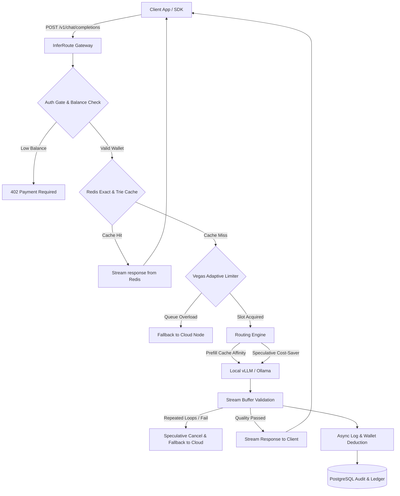

# 🎯 InferRoute: High-Availability LLM Inference Gateway & Observability Router

InferRoute is built upon robust theoretical frameworks for cost-performance trade-offs and multi-tier cascading inference.

<p align="center">
  
  
  
  
</p>

> 🚀 **Live Technical Hub & Interactive Cascade Simulator**: **[https://ypeng12.github.io/InferRoute/](https://ypeng12.github.io/InferRoute/)**  
> Visit the hosted page to interact with the live sequence charts, LaTeX formula guides, original paper previews, and the FrugalGPT sequential cascade simulator!

---

## 📖 Introduction

**InferRoute** is a lightweight, high-performance LLM inference gateway and reliability proxy. Sitting between client applications/AI agents and model backends (local Ollama/vLLM engines and commercial APIs like OpenAI/Gemini), it dynamically routes queries to optimize for **cost, latency, and quality** in real-time.

Rather than statically pinning your application to a single expensive cloud endpoint, InferRoute dynamically routes prompts based on **real-time quality validation, cost constraints, latency tracking, and prefix KV-cache affinity**, demonstrating **over 60% in API cost savings** in benchmark sweeps while guaranteeing strict latency and formatting SLAs.

<p align="center">
  
</p>

---

## ⚡ Key Technical Highlights

* **🔄 Distributed Streaming Deduplication**: Implements a Redis lock for duplicate concurrent prompts. The first request invokes the LLM while subsequent callers subscribe to the stream via **Redis Pub/Sub**, broadcasting token chunks simultaneously to avoid duplicate API fees.
* **🌳 Radix Trie prefix KV-Cache Affinity**: Hashes prompt prefixes in a Prefix Tree to route requests to local GPU nodes holding warm KV caches, reducing Time-to-First-Token (TTFT) by up to 80%.
* **🛡️ Vegas Adaptive Concurrency Control**: Scales gateway concurrency slots dynamically based on active queue size tracking via a TCP Vegas congestion control loop to protect local GPUs from OOM failures.
* **🔀 Speculative Fallback Cascades**: Buffers response stream tokens, cancels degraded local streams speculatively (on loop or gibberish detection), and escalates to premium cloud nodes mid-stream to avoid service disruptions.
* **💳 Multi-Tenant Billing Gateway**: Validates tenant credentials and credits against an asynchronous PostgreSQL audit ledger, enforcing a resilient fail-open policy if the database is unreachable.

---

## 🏗️ Gateway Request Lifecycle

The diagram below outlines how the gateway intercepts client requests, checks caches, scales concurrency, and handles fallback cascades:



---

## 🧠 RouterBench Integration & Theoretical Foundations

> [!TIP]
> For a detailed breakdown of routing algorithms, mathematical proofs, and model mapping logic, see our dedicated **[Academic Foundations Guide](docs/academic_foundations.md)**.

InferRoute integrates the core routing methodologies and trade-off evaluation principles from the research paper:
> **ROUTERBENCH: A Benchmark for Multi-LLM Routing System** (by Martian / [withmartian/routerbench](https://github.com/withmartian/routerbench)).  
> 📄 **[Read RouterBench Paper PDF](docs/article/A_Benchmark_for_Multi_LLM_Routing_System.pdf)**

### 1. Mathematical Scoring & Optimization
Predictive routing is formulated as choosing a backend $m$ that maximizes the utility score for a prompt $x$:
$$\text{Score}(m) = \lambda \cdot \text{Quality}_{\text{pred}}(m) - \text{Cost}(m)$$

Where:
* **$\lambda$ (lambda)**: User's willingness to pay. A high $\lambda$ (e.g. 5.0) prioritizes output quality (routing to GPT-4o-mini or Gemini-Flash). A low $\lambda$ (e.g. 0.1) prioritizes cost savings (routing to local vLLM/Ollama).
* **$\text{Quality}_{\text{pred}}(m)$**: Predicted quality score of model $m$ on prompt $x$ (ranging from $0.0$ to $1.0$).
* **$\text{Cost}(m)$**: The estimated economic API fee to process the request on backend $m$.

### 2. Supported Routing Policies
InferRoute supports six distinct routing strategies aligned with the paper's framework:
1. **🎲 Zero Router Baseline (`zero`)**: Non-content-aware routing. Randomly routes requests to Cloud/Expensive vs. Local/Cheap backends based on a target cloud mixture ratio $p$. Sweeping $p \in [0, 1]$ constructs the baseline cost-quality curve.
2. **📋 Rule-Based Router (`rule`)**: Content-aware heuristics. Evaluates prompt keywords to route tasks (e.g., routing math tasks to GPT/Gemini, coding tasks to vLLM, simple greetings to Ollama).
3. **🧠 KNN-Based Router (`knn`)**: Retrieves the $K$ most textually similar prompts (using Jaccard similarity) from historical benchmark outcomes. Computes the average historical quality per backend and optimizes via $\lambda \cdot \text{Quality} - \text{Cost}$.
4. **🕸️ MLP-Based Router (`mlp`)**: A fast logistic regression classifier that extracts prompt features (`is_code`, `is_math`, `is_json`, `is_long`) to predict success probability as predicted quality, then optimizes using the cost-quality formula.
5. **🔮 Oracle Router Offline Upper Bound (`oracle`)**: A theoretical upper bound that has advance knowledge of whether each model will answer correctly. It selects the cheapest model that achieves a quality score $\ge 0.8$.
6. **🔄 Cascade Router (FrugalGPT) (`cascade`)**: Server-side model cascade. Executes the cascade chain (cheap local models up to premium cloud models) until the reliability judge score meets the acceptance threshold $\tau$.

### 3. Metric: AIQ (Area Under the Curve)
To measure a router's overall efficiency across all budgets, we compute the **AIQ (Area under the cost-quality curve)** using the Trapezoidal Rule over swept parameter values ($\lambda$ or $p$):
$$\text{AIQ} = \int_{c_{\min}}^{c_{\max}} Q(c) \, dc \approx \sum_{i=0}^{n-1} \frac{q_i + q_{i+1}}{2} \cdot (c_{i+1} - c_i)$$

A smart, content-aware learned router (MLP/KNN) will push the Pareto frontier towards the top-left, achieving a **significantly higher AIQ** than the Zero Router baseline.

---

## 🔄 FrugalGPT Cascading Inference (LLM Cascade)

InferRoute integrates the cost-performance optimization concepts from the paper:
> **FrugalGPT: How to Use Large Language Models While Reducing Cost and Improving Performance** (by Stanford University / arXiv:2305.05196).  
> 📄 **[Read FrugalGPT Paper PDF](docs/article/How_to_Use_Large_Language_Models.pdf)** | 📄 **[Read Hybrid LLM Routing Paper PDF](docs/article/cost_efficiency.pdf)**

FrugalGPT identifies three main classes of cost-saving methods:
1. **Prompt Adaptation**: Reduces input tokens dynamically. In InferRoute, when routing to cheap local backends (Ollama/vLLM), the **Prompt Adapter** (`prompt_adapter.py`) automatically compresses prompt sizes by pruning few-shot examples, restoring full prompts when upgrading to premium models.
2. **LLM Approximation (Completion Cache)**: Caches full answers. Handled by InferRoute's exact completions caching layer in Redis.
3. **LLM Cascade**: Sequential invocation of backends (e.g., `ollama` ➔ `vllm` ➔ `gemini` ➔ `openai`). The request starts with the cheapest backend, passes through a **Reliability Judge** (syntactic check, schema validation, loop penalty), and only escalates to a more expensive tier if the quality score is below the acceptance threshold $\tau$.

### 1. Cascade Configuration
Select `Cascade Router (FrugalGPT Style)` in the routing options, and adjust the acceptance threshold $\tau \in [0.0, 1.0]$. The gateway executes the cascade loop entirely server-side, accumulating tokens and fees across all tried models to log in the PostgreSQL database correctly.

### 2. Streaming Cascade Buffer
To prevent leaking low-quality responses to clients during streaming requests, the gateway buffers stream chunks internally, executes quality grading, and only pumps the SSE stream to the client once the output is officially accepted.

---

## 📊 Reproducible Evaluation Harness

InferRoute includes a standardized pipeline to test and compare multiple routing strategies under realistic workloads, sweeping ratios and lambdas to trace Pareto frontiers. Our benchmarks demonstrate a **56% cost reduction** (using KNN/MLP routers) compared to always calling OpenAI, while matching its baseline output quality.

Read the detailed cost-quality comparison report: **[Router Evaluation Summary Report (docs/evaluation_summary.md)](docs/evaluation_summary.md)**.

```bash
# 1. Run the evaluation orchestrator (sweeps Zero Router p-ratios and KNN/MLP lambda values)
python benchmarks/run_router_eval.py

# 2. Compile stats, compute AIQ values, and generate visual Pareto curves
python benchmarks/plot_results.py
```
This runs the dataset prompts across all scenarios and sweeps, and outputs cost, quality, latencies, SLO compliance, and AIQ comparisons to the public summary report and plots.

---

## 🎨 Interactive Playground & Chaos Simulator

InferRoute includes a built-in interactive control center panel served at the root (`/`) path:
* **Live Cost Dashboard**: Displays money saved ($ USD), tokens saved, TTFT latency, and Redis cache hit rate.
* **Request Pipeline Visualizer**: Renders a vertical stepper showing step-by-step processing of the query (Cache checking, Limiter checking, Node executing, and Cascades).
* **Simulated Wallet & Recharge**: Top-right wallet indicator showing current credits (e.g., `$5.00` trial credit) with a simulated `+ $10` recharge button.
* **Chaos Engineering & Failure Injection**: A panel to manually kill or throttle model nodes, observing the circuit-breaker turning Red and routing self-healing in real-time.

For detailed performance, concurrency, and cost reports under heavy loads, check out the **[Benchmark Report](docs/benchmark.md)**.

---

## 🚀 Quick Start (Running Offline in 10 Seconds)

InferRoute features a built-in **Simulation Mode** (using SQLite and Mock adapters) allowing you to boot and explore the gateway **completely for free, offline, with zero real API keys**!

### 1. Requirements
* Python 3.12 or 3.13
* Docker & Docker Compose (Optional, for production Postgres/Redis/Grafana observability)

### 2. Installation
```bash
# Clone the repository
git clone https://github.com/ypeng12/InferRoute.git
cd InferRoute

# Initialize virtual environment
python -m venv .venv
source .venv/bin/activate  # On Windows: .venv\Scripts\activate

# Install dependencies
pip install -r requirements.txt
```

### 3. Create Local Config File
Create a `.env` file in the root directory:
```env
DATABASE_URL=sqlite+aiosqlite:///inferroute.db
MOCK_OPENAI=true
MOCK_GEMINI=true
MOCK_VLLM=true
MOCK_OLLAMA=true
```

### 4. Start the Gateway
```bash
python -m uvicorn inferroute.main:app --host 127.0.0.1 --port 8080 --reload
```
Open **[http://127.0.0.1:8080](http://127.0.0.1:8080)** in your browser to interact with the dashboard immediately!

---

## 🛠️ Unified Integration (OpenAI Drop-In)

InferRoute is compatible with the standard OpenAI API chat completions format. You can switch your existing codebases to run through InferRoute in just one line:

```python
import openai

client = openai.OpenAI(
    base_url="http://localhost:8080/v1",
    api_key="sk-inferroute-demo"  # Custom tenant auth key
)

response = client.chat.completions.create(
    model="edge/auto",  # Dynamic auto-routing
    messages=[
        {"role": "user", "content": "Write a quicksort in Python."}
    ],
    stream=True
)

for chunk in response:
    content = chunk.choices[0].delta.content
    if content:
        print(content, end="", flush=True)
```

---

## 📚 Project Documentation

Explore the following detailed guides for in-depth engineering breakdowns:
* **[Academic Research & Mathematical Foundations](docs/academic_foundations.md)**: Details of how FrugalGPT and RouterBench optimization theories map to our gateway components.
* **[Performance & Cost Benchmarks](docs/benchmark.md)**: Concrete metrics, cache stampede statistics, and reproduction logs.
* **[Inference Gateway Architecture](docs/architecture.md)**: Sequence diagrams of the request lifecycle and core sub-components.
* **[Failure Injection & High Availability](docs/failure-injection.md)**: Details on fail-open mechanisms and circuit breaker status thresholds.

---

## 📊 Observability Stack (Production Environment)

In a production environment, spin up the containerized observability stack to monitor traffic, metrics, and traces:
```bash
# Boot Postgres, Redis, OTtel Collector, Jaeger, Prometheus, Grafana
docker compose up -d
```
* **Grafana Dashboard (Performance Metrics)**: [http://localhost:3000](http://localhost:3000) (Admin/Admin)
* **Jaeger UI (Microservices Traces)**: [http://localhost:16686](http://localhost:16686)

---

## 🛡️ License

This project is licensed under the MIT License. See [LICENSE](LICENSE) for details.
