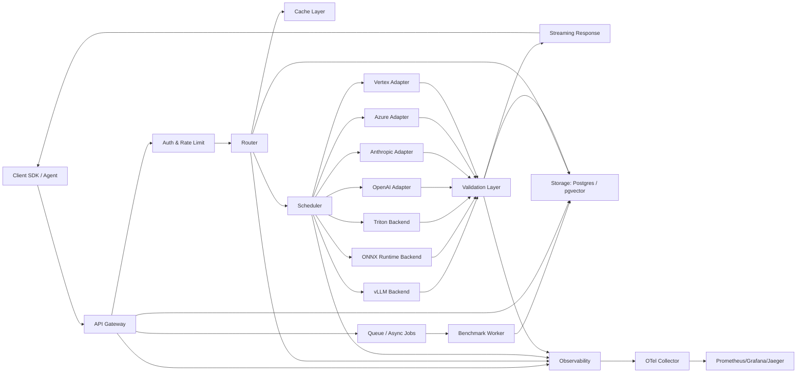
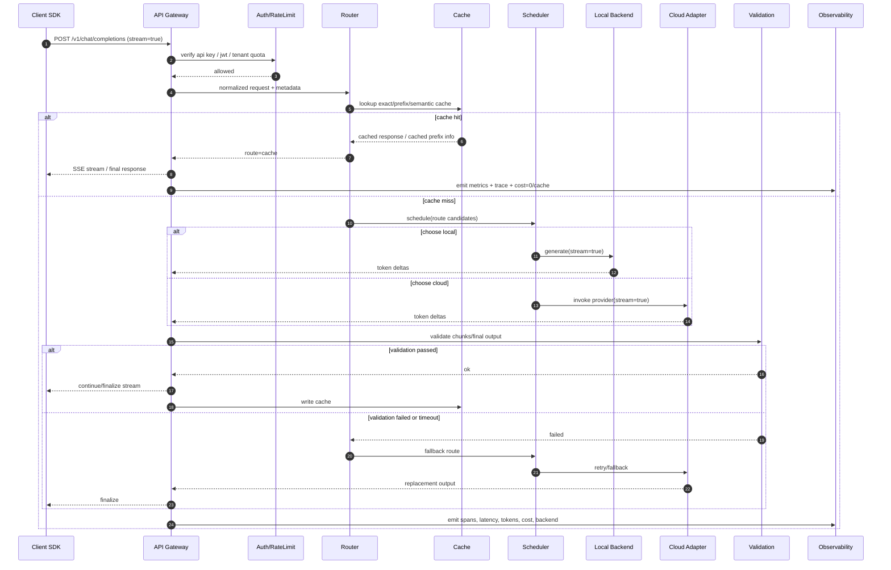

# EdgeServe AI 生产级低延迟 LLM 推理路由与可观测平台设计报告

## 执行摘要

EdgeServe AI 的最佳作品集定位，不是“又一个 AI 聊天壳”，而是一个**面向生产流量的低延迟 LLM Gateway**：它统一接入本地推理引擎与云模型 API，在请求进入后完成鉴权、限流、意图识别、路由决策、缓存命中、流式返回、失败回退、成本归集与端到端可观测。这类项目能同时覆盖 Amazon/Google 偏好的分布式系统、SRE/可观测、API 设计与弹性扩缩，也能覆盖 NVIDIA/Tesla 更看重的推理后端、GPU 调度、量化和吞吐/延迟基准。官方资料表明，vLLM 已提供 OpenAI 兼容服务、前缀缓存、Prometheus 指标与分布式 tensor/pipeline parallel；Ray Serve LLM 则强调多节点推理、自动扩缩、自定义路由与 Grafana 仪表盘；Kubernetes 原生支持 HPA、多指标扩缩与设备插件；OpenTelemetry Collector、Prometheus、Grafana、Jaeger 形成一条标准化、供应商无关的观测链路。citeturn17search9turn18search0turn1search0turn1search1turn0search2turn13search0turn22search2turn23search1turn10search2

如果只做作品集版本，最推荐的技术路径是：**FastAPI/Starlette API Gateway + 自研 Router/Scheduler + Redis 缓存/队列 + Postgres/pgvector 元数据层 + vLLM 本地 GPU 推理 + OpenAI/Anthropic/Vertex/Azure 适配器 + Prometheus/Grafana/Jaeger**。原因很直接：FastAPI/Starlette 适合快速产出异步 HTTP 和流式响应；Redis 既适合全局限流，也适合消费者组与异步队列；Postgres 可做审计、账单、请求日志与配置，pgvector 可做语义缓存或路由辅助；vLLM 对本地部署最友好，Triton 更适合多框架、动态批处理和 NIM 风格生产环境，ONNX Runtime 更适合边缘与 CPU/轻量 GPU 场景。citeturn16search0turn14search0turn12search0turn12search6turn11search1turn17search9turn18search0turn0search7turn0search1turn19search0turn19search1

本报告默认以下条件均为**未指定**，因此采用工程上可解释的基线假设：云厂商未指定；目标模型族未指定；目标请求量未指定；是否需要多区域高可用未指定；是否必须兼容 OpenAI API 未指定。为便于实现，后文将默认：在线服务基线为 7B–8B 指令模型、单机 1×L4/A10 作为本地 GPU 起点；外部云模型优先采用通用文本模型；接口优先实现 OpenAI 风格 `/v1/chat/completions` 与 `/v1/responses`；先做单区域、单集群、可回放、可基准，再做多集群和更复杂调度。

## 产品目标与系统边界

EdgeServe AI 的目标用户不应泛泛定义为“所有 LLM 开发者”，而应明确到三类：

| 目标用户 | 核心诉求 | 对应价值 |
|---|---|---|
| 应用后端工程师 | 统一调用不同模型，降低供应商切换成本 | 单一 API、策略路由、统一鉴权与配额 |
| AI 平台/SRE 工程师 | 看清延迟、错误、成本、命中率与 GPU 使用 | 指标、追踪、告警、回放、成本归集 |
| 推理/性能工程师 | 比较本地引擎与云 API 的 TTFT、吞吐、成本 | 基准框架、A/B 路由、批处理与缓存实验 |

项目的**产品目标**建议限制在五个方面：  
其一，提供统一的文本/工具调用推理入口；其二，在本地与云后端间做可解释路由；其三，支持 SSE 流式输出和失败回退；其四，暴露完整的延迟/吞吐/成本/缓存指标；其五，提供一个可复现 benchmark harness。这样的边界既足够“生产味”，又不会在作品集阶段无限膨胀。OpenAI、Anthropic、Vertex 与 Azure 官方文档都已分别提供流式、缓存、批量或可恢复响应等能力，因此做一个上层网关并非重复造轮子，而是把不同供应商能力抽象为统一策略面。citeturn26search2turn26search0turn25search0turn24search1turn8search3

**非目标**也应明确：不做模型训练；不在 MVP 中做多区域双活；不做复杂多模态编排；不承诺企业级 IAM 联邦；不实现所有供应商的全部参数；不做强一致全局缓存。这样可以避免项目像“平台愿景”而不是“可实现工程”。

对大厂作品集来说，真正加分的是**工程可证据性**：  
你能展示统一 API 契约；能解释路由依据；能给出 p50/p95/p99、TTFT、tokens/s、缓存命中率、单位请求成本；能复现实验；能用追踪说明一次慢请求在哪一层卡住。这比做二十个 provider adapter 更重要。Prometheus 官方明确建议用 histogram 在 Prometheus 侧计算 quantile；Grafana 提供可参数化仪表盘；Jaeger/OpenTelemetry 能把一次请求跨 Gateway、Router、Cache、Provider Adapter 关联起来。citeturn11search2turn10search2turn10search14turn22search2turn23search0

## 架构与数据流

EdgeServe AI 的推荐高层架构如下。其核心原则是：**控制面与数据面分离，在线请求路径尽量短，观测与成本计算异步化，回退路径内建而不是事后补救。**



这个架构与主流组件能力是对齐的：Kubernetes 通过 Device Plugin 暴露 GPU 资源，通过 HPA 基于多指标扩缩；NVIDIA GPU Operator 可以自动化驱动、容器运行时、GPU device plugin 与 DCGM 监控；OpenTelemetry Collector 负责接收、处理与导出 traces/metrics/logs；Jaeger 负责 trace 查询与 UI；Prometheus/Grafana 形成度量与仪表盘层。citeturn13search0turn13search3turn10search1turn22search2turn23search4turn23search1turn10search2

建议把组件职责严格切开：

| 组件 | 职责 | 备注 |
|---|---|---|
| Client SDK / Agent | 重试、SSE 解码、request-id 透传 | 轻量，不做策略 |
| API Gateway | HTTP 入口、协议兼容、请求标准化 | FastAPI/Starlette |
| Auth | API Key / JWT / 租户配额 | 入口即拦截 |
| Router | 意图分类、成本/延迟/缓存感知选路 | 核心逻辑 |
| Scheduler | 并发控制、批处理、队列策略 | 本地后端更关键 |
| Cache | 前缀缓存、响应缓存、语义缓存 | Redis + 可选 pgvector |
| Backend Adapters | 屏蔽 provider 差异 | 请求/响应标准化 |
| Validation Layer | JSON schema、工具结果、幻觉检查 | 输出前最后一道关 |
| Storage | 审计、配置、账单、请求状态 | Postgres |
| Observability | traces、metrics、logs、cost events | OTel + Prometheus |

在线请求的标准时序建议如下：



离线基准与回放则走异步路径：Gateway 把 benchmark job 写入 Redis Streams，worker 消费并把每轮 run 的 raw metrics、route 决策、provider 响应时间、输出摘要写入 Postgres。Redis Streams 官方说明它支持 consumer groups、`XREADGROUP`、`XACK`、`XPENDING`、`XCLAIM`/`XAUTOCLAIM`，适合做有重放与故障接管的工作流；同一套 Redis 还可复用作全局速率限制器。citeturn12search6turn12search7turn12search5turn12search0

## 路由策略与后端选型

路由策略不应写成“如果便宜就走便宜模型”这种玩具逻辑。更合理的是把路由建模为**多目标优化**：  
在线请求关心 TTFT、p95、失败率、缓存命中概率、结构化输出可靠性和单位 token 成本；  
异步批处理则更看吞吐、GPU 利用率与总账单。

推荐的路由评分函数可以写成：

```text
score(backend) =
  w1 * predicted_ttft_ms
+ w2 * predicted_p95_ms
+ w3 * expected_cost_usd
+ w4 * failure_risk
- w5 * cache_hit_bonus
- w6 * structured_output_confidence
- w7 * locality_bonus
```

其中：
- `predicted_ttft_ms`：由最近 N 分钟 rolling window + prompt length bucket 估计；
- `expected_cost_usd`：云端直接按 published pricing 计算，本地则按 GPU 小时成本摊销；
- `failure_risk`：过去 5 分钟 provider 429/5xx/timeout 的指数平滑值；
- `cache_hit_bonus`：前缀相似度或 exact cache 命中概率；
- `structured_output_confidence`：历史 JSON schema 失败率的反向分数；
- `locality_bonus`：同区域、同 VPC、同 provider 会减少网络抖动。

### 路由策略建议

| 策略 | 何时启用 | 规则 |
|---|---|---|
| 延迟优先 | 用户交互式 chat / code assist | 以 TTFT 与 p95 为主，必要时牺牲成本 |
| 成本优先 | 批量摘要 / nightly jobs | 走 batch/flex、低价模型或本地队列 |
| 准确率优先 | JSON 提取 / tool calling / long reasoning | 走结构化输出更稳定的后端 |
| 意图优先 | intent=chat/code/extract/summarize | 按任务类型映射默认后端 |
| 缓存优先 | 重复 system prompt / repo analysis | 优先命中 prefix/context cache |
| 回退优先 | 本地 OOM、timeout、validation fail | 本地失败立即切云端 |
| 批处理优先 | 同模型/同参数/同长度 bucket | 微批处理，控制最大等待窗口 |
| 流式优先 | stream=true | backend 不支持真正流式则降级或避开 |

Ray Serve LLM 官方已经把“prefix-aware / session-aware / custom routing”“autoscaling”“multi-node distributed serving”“Grafana dashboards”视为一等能力，所以如果你后期想把自研 Scheduler 升级为分布式服务层，Ray Serve 是合理演进方向。citeturn1search0turn1search1turn1search2turn1search5

### 本地推理后端选型

| 后端 | 最适合场景 | 优点 | 缺点 | 推荐结论 |
|---|---|---|---|---|
| vLLM | 单模型或少量模型、LLM 在线服务 | OpenAI 兼容、PagedAttention、前缀缓存、Prometheus 指标、tensor/pipeline parallel | GPU 导向，CPU 场景不强 | **MVP 首选** |
| ONNX Runtime GenAI | 边缘部署、CPU/小 GPU、Jetson/Windows 兼容 | 有 Generate API、Execution Providers 丰富、INT8/INT4、ORT format 适合轻量环境 | API 仍处 preview，LLM serving 生态不如 vLLM 成熟 | **边缘/嵌入式首选** |
| Triton Inference Server | 多框架、多模型仓库、生产批处理与统一推理网关 | 动态批处理、模型仓库、Prometheus 指标、Perf Analyzer、框架覆盖广 | 配置复杂，纯 LLM 场景上手成本高于 vLLM | **生产强化/多模型阶段推荐** |

这张表背后有明确依据：vLLM 官方提供 OpenAI 兼容 server、自动前缀缓存与 Prometheus `/metrics`，并支持 tensor/pipeline parallel；其 PagedAttention 论文报告在同等延迟下，相比先前系统吞吐可提升 2–4×。ONNX Runtime GenAI 官方说明其 `generate()` API 覆盖 tokenization、sampling、logits processing 与 KV cache 管理，且可通过 CUDA、TensorRT 等 Execution Provider 做硬件加速，并支持 INT8/INT4 量化与 ORT format。Triton 官方明确支持多框架、x86/ARM CPU 与 NVIDIA GPU，动态批处理、模型仓库与 Prometheus 指标，以及 Perf Analyzer 采集服务端指标。citeturn17search9turn17search7turn18search0turn17search10turn1academia37turn19search0turn19search1turn19search2turn19search5turn19search7turn0search7turn0search1turn20search1turn21search1turn21search8

### 本地后端延迟/成本/吞吐的工程判断

下表是**作品集阶段可用的工程预期**，不是厂商公示值，必须以后文 benchmark 实测为准：

| 后端 | 典型硬件 | TTFT 预期 | 吞吐预期 | 成本模型 | 适用判断 |
|---|---|---:|---:|---|---|
| vLLM | 1×L4/A10 | 低到中 | 高 | GPU 小时成本摊销 | 交互式主力 |
| ONNX Runtime(CUDA/TensorRT) | L4/Jetson | 中 | 中 | GPU/边缘设备摊销 | 边缘或轻量 |
| ONNX Runtime(CPU/XNNPACK/默认 EP) | x86 | 中到高 | 低 | CPU 成本低 | 小模型/低并发 |
| Triton + TensorRT/ONNX | L4/A10/A100 | 中 | 高到很高 | GPU + 运维复杂度 | 多模型/批量 |

### 云厂商能力与成本考量

| 云后端 | 流式 | 缓存 | 价格/计费特点 | 适合路由策略 | 备注 |
|---|---|---|---|---|---|
| OpenAI | 支持 SSE 语义事件 | Prompt Caching，支持 `prompt_cache_key`，1024+ token 自动启用 | 文本按 1M token 计费；如 `gpt-5-mini` 输入 $0.25、缓存输入 $0.025、输出 $2 | 延迟优先、缓存优先 | service tier 可作为策略字段 |
| Anthropic | 支持流式；`stop_reason` 明确 | 5m/1h cache write 与 cache read 计费 | 如 Claude Sonnet 4 输入 $3/MTok、缓存命中 $0.30/MTok、输出 $15/MTok；Batch API 50% 折扣 | 长上下文、准确率优先、批处理 | tier 化速率限制明显 |
| Vertex AI | 支持 `streamGenerateContent` | implicit/explicit context caching；隐式缓存默认开启，缓存 token 90% 折扣 | Gemini 2.5 Flash 标准输入 $0.30/MTok、缓存输入 $0.03/MTok、输出 $2.50/MTok；Flex/Batch 更便宜 | 成本优先、缓存优先、Google Cloud 内网优先 | explicit cache 另有 storage 费用 |
| Azure OpenAI | 支持 Responses/Chat；支持 background+stream 恢复 | 计费按 token 和部署类型；也支持 provisioned throughput | 官方抓取页价格数值未稳定解析，且与区域/Global/Data Zone/Regional 部署相关，**此处视为 unspecified** | 数据驻留优先、企业网络优先 | background mode 官方注明 TTFT 更高 |

以上价格与能力来自官方文档：OpenAI 的 Psilrompt Caching 文档声明可将延迟最多降低 80%、输入成本最多降低 90%，并支持 `prompt_cache_key`；OpenAI pricing 页给出当前 1M token 价格。Anthropic pricing 页给出了 base input、cache write/read 与 output 的分项价格，并给出 Batch API 50% 折扣。Vertex 官方同时给出标准价、Priority 与 Flex/Batch 价，另有 explicit context cache storage 价格与 90% implicit cache 优惠。Azure 官方文档明确支持 Responses API、background+stream 恢复，但也提示 background responses 目前 TTFT 较高；其成本页强调 token-based pricing 与按部署/区域变化，公开抓取结果中部分具体数值未解析出来，因此本报告按“未指定”处理。citeturn26search0turn2search2turn25search0turn24search1turn28view0turn28view2turn8search3turn8search7turn9search2

### 建议的 benchmark 方案

基准测试不要只测平均延迟。建议至少测八项：  
TTFT、总时延、tokens/s、p50/p95/p99、失败率、429/5xx 占比、缓存命中率、每 1K 请求成本。  
对本地引擎，直接抓 vLLM `/metrics` 的 `time_to_first_token_seconds`、`inter_token_latency_seconds`、`kv_cache_usage_perc`、`prefix_cache_hits/queries` 等指标；对 Triton，使用 Perf Analyzer 采 `--collect-metrics` 并对 `localhost:8002/metrics` 拉取 GPU 和请求统计；对云端 API，则在适配器层记录 provider RTT、TTFT 和 token 用量。citeturn18search0turn21search1turn21search8

推荐基准矩阵：

| 维度 | 取值 |
|---|---|
| Prompt 长度 | 256 / 2K / 8K / 32K |
| Output 长度 | 64 / 256 / 1K |
| 并发 | 1 / 8 / 32 / 128 |
| 命中率 | 0% / 25% / 50% / 80% |
| 任务类型 | chat / code / extract-json / summarize / tool-call |
| 流式 | on / off |
| 批处理窗口 | 0ms / 10ms / 25ms / 50ms |
| 故障注入 | timeout / 429 / 5xx / local OOM |

## 接口、可观测性与安全

作品集版本最合适的做法，是把对外 API 设计成**OpenAI 风格兼容 + 少量管理端点**。这样既利于接现有 SDK，也利于展示你对 API 演进与协议兼容的理解。vLLM 与 Ray Serve LLM 都强调 OpenAI-compatible API；OpenAI/Vertex/Azure 文档也都在各自接口中体现了流式与 response-centric API 方向。citeturn17search9turn1search0turn26search2turn8search3turn8search4

### 推荐 API 端点

| 方法 | 路径 | 说明 |
|---|---|---|
| POST | `/v1/chat/completions` | OpenAI 风格入口，支持 `stream=true` |
| POST | `/v1/responses` | 通用响应接口，便于多供应商抽象 |
| GET | `/v1/models` | 列出逻辑模型与后端映射 |
| GET | `/v1/requests/{id}` | 获取请求状态、路由、成本、trace id |
| POST | `/v1/admin/benchmarks/run` | 提交 benchmark job |
| GET | `/v1/admin/routes/stats` | 查看每个 backend 的成功率/TTFT/成本 |
| GET | `/healthz` | 存活探针 |
| GET | `/readyz` | 就绪探针 |
| GET | `/metrics` | Prometheus 指标 |

### 统一请求结构建议

```json
{
  "model": "edge/auto",
  "messages": [
    {"role": "system", "content": "You are a JSON extraction assistant."},
    {"role": "user", "content": "Extract fields from this invoice..."}
  ],
  "stream": true,
  "temperature": 0.2,
  "max_output_tokens": 512,
  "response_format": {
    "type": "json_schema",
    "json_schema": {
      "name": "invoice_schema",
      "schema": {
        "type": "object",
        "properties": {
          "invoice_id": {"type": "string"},
          "amount": {"type": "number"}
        },
        "required": ["invoice_id", "amount"]
      }
    }
  },
  "routing": {
    "policy": "latency",
    "allow_local": true,
    "allow_cloud": true,
    "preferred_region": "us-west",
    "budget_usd": 0.02
  },
  "metadata": {
    "tenant_id": "acme",
    "request_id": "req_123",
    "trace_id": "optional"
  }
}
```

### 统一响应结构建议

```json
{
  "id": "resp_123",
  "object": "response",
  "status": "completed",
  "model": "openai/gpt-5-mini",
  "logical_model": "edge/auto",
  "route": {
    "selected_backend": "openai",
    "fallback_count": 0,
    "cache_hit": false,
    "policy": "latency"
  },
  "output": [
    {
      "type": "message",
      "role": "assistant",
      "content": [{"type": "output_text", "text": "{\"invoice_id\":\"A-10\",\"amount\":123.45}"}]
    }
  ],
  "usage": {
    "input_tokens": 1180,
    "cached_input_tokens": 1024,
    "output_tokens": 74,
    "estimated_cost_usd": 0.0018
  },
  "timing": {
    "queue_ms": 12,
    "ttft_ms": 238,
    "latency_ms": 811
  },
  "observability": {
    "trace_id": "4f9c...",
    "span_id": "ab12..."
  }
}
```

### 错误码建议

| HTTP | 业务码 | 含义 | 处理建议 |
|---|---|---|---|
| 400 | `invalid_request` | schema/参数错误 | 直接返回 |
| 401 | `unauthorized` | API key/JWT 无效 | 不重试 |
| 403 | `forbidden` | 租户策略拒绝 | 不重试 |
| 404 | `model_not_found` | 逻辑模型不存在 | 不重试 |
| 409 | `benchmark_running` | 并发管理任务冲突 | 稍后重试 |
| 422 | `validation_failed` | JSON schema/工具结果校验失败 | 可触发 fallback |
| 429 | `rate_limited` | 本地或 provider 限流 | 按 `retry-after` 或退避 |
| 502 | `provider_error` | 上游适配器失败 | 可重试/可回退 |
| 504 | `provider_timeout` | 上游超时 | 强制 fallback |
| 507 | `local_capacity_exhausted` | GPU/KV cache/队列耗尽 | 走云端回退 |

OpenAI 官方说明速率限制按 RPM/RPD/TPM/TPD/IPM 计，并在响应头返回 `x-ratelimit-*`；Anthropic 官方说明速率限制按 RPM、ITPM、OTPM 分层，并在 429 中返回 `retry-after`。因此 Router 与 Adapter 层应读取这些头信息，把 provider 自身的限流信号回灌到后续路由评分，而不是仅靠本地固定阈值。citeturn26search1turn5search5

### 可观测性指标与仪表盘

Prometheus 官方建议用 histogram + `histogram_quantile()` 做 p95/p99；vLLM 也直接暴露 TTFT、inter-token latency、KV cache usage、prefix cache hits 等关键指标；Jaeger 后端默认也暴露 Prometheus metrics。citeturn11search2turn18search0turn23search2

推荐暴露如下指标：

| 指标名 | 类型 | 说明 |
|---|---|---|
| `edgeserve_request_total{tenant,model,backend,status}` | Counter | 总请求数 |
| `edgeserve_request_latency_seconds` | Histogram | 端到端时延 |
| `edgeserve_ttft_seconds` | Histogram | 首 token 时间 |
| `edgeserve_inter_token_latency_seconds` | Histogram | token 间延迟 |
| `edgeserve_queue_depth{backend}` | Gauge | 调度队列深度 |
| `edgeserve_cache_hit_total{type=exact|prefix|semantic}` | Counter | 各类缓存命中 |
| `edgeserve_provider_cost_usd_total{backend,tenant}` | Counter | 累积成本 |
| `edgeserve_validation_fail_total{reason}` | Counter | 输出校验失败数 |
| `edgeserve_routing_decision_total{policy,backend}` | Counter | 路由落点统计 |
| `edgeserve_fallback_total{from,to,reason}` | Counter | 回退事件 |
| `edgeserve_rate_limited_total{scope}` | Counter | 限流触发数 |

Grafana 仪表盘建议按四屏组织：  
第一屏“服务健康”：QPS、错误率、p50/p95/p99、TTFT。  
第二屏“路由健康”：每个 backend 的请求占比、fallback、限流、成功率。  
第三屏“成本与缓存”：单位请求成本、租户成本排行、cache hit rate、cached tokens。  
第四屏“本地资源”：GPU 利用率、显存、KV cache usage、队列深度、批处理大小。Grafana 官方支持变量化仪表盘，因此可按 tenant/model/backend/env 切换。citeturn10search2turn10search14

### 安全、鉴权、限流与成本归集

安全层建议最小实现四件事：  
一是 API key 与 JWT 双模式认证；二是按租户与模型维度限流；三是数据库行级隔离；四是审计日志。FastAPI 官方提供 `OAuth2PasswordBearer`，适合作为作品集中的标准鉴权入口；PostgreSQL 官方 Row-Level Security 可以在表级按用户/角色过滤行；Redis 官方给出了分布式 rate limiter 的常见实现方式，适合做 tenant/model/IP 三维限流。citeturn15search0turn15search3turn11search0turn12search0

成本归集建议按照下面公式统一：

```text
request_cost_usd =
  provider_input_tokens * input_unit_price
+ provider_cached_input_tokens * cached_input_unit_price
+ provider_output_tokens * output_unit_price
+ explicit_cache_storage_cost
+ local_gpu_amortized_cost
+ network_egress_cost
```

其中云端价格直接按 provider 文档版本化配置；本地成本用“GPU 每小时价格 × 请求占用时间 / 3600 × 并发折算”估计。这样你就能在 `/v1/requests/{id}` 和 Grafana 上同时给出“真实云侧成本”和“本地摊销成本”。

## 部署、CI/CD 与示例清单

如果不指定云厂商，最稳妥的部署模型就是：**本地 Docker Compose 开发 + Kubernetes 生产化演示**。  
Kubernetes 侧使用 Deployment/Service/Ingress/HPA + NVIDIA GPU Operator + Prometheus/Grafana/Jaeger；本地侧用 Compose 启动 gateway、redis、postgres、jaeger、prometheus、grafana，加一个可选 vLLM 容器。Kubernetes 的 HPA 支持 custom metrics 与 multiple metrics，并且会取各指标建议副本数的最大值；GPU 则通过 device plugin 与 `nvidia.com/gpu` 资源请求；GPU Operator 会自动装驱动、container toolkit、device plugin 与 DCGM 监控。citeturn0search2turn13search0turn13search3turn10search1

### Dockerfile 轮廓

```dockerfile
FROM python:3.12-slim

WORKDIR /app
ENV PYTHONDONTWRITEBYTECODE=1
ENV PYTHONUNBUFFERED=1

COPY pyproject.toml poetry.lock* /app/
RUN pip install --no-cache-dir poetry && poetry config virtualenvs.create false \
    && poetry install --only main --no-interaction --no-ansi

COPY . /app
EXPOSE 8080
CMD ["uvicorn", "edgeserve.main:app", "--host", "0.0.0.0", "--port", "8080"]
```

### Kubernetes 示例清单

```yaml
apiVersion: apps/v1
kind: Deployment
metadata:
  name: edgeserve-gateway
spec:
  replicas: 2
  selector:
    matchLabels:
      app: edgeserve-gateway
  template:
    metadata:
      labels:
        app: edgeserve-gateway
    spec:
      containers:
        - name: gateway
          image: ghcr.io/you/edgeserve:latest
          ports:
            - containerPort: 8080
          env:
            - name: REDIS_URL
              value: redis://redis:6379/0
            - name: DATABASE_URL
              valueFrom:
                secretKeyRef:
                  name: edgeserve-secrets
                  key: database-url
          readinessProbe:
            httpGet:
              path: /readyz
              port: 8080
          livenessProbe:
            httpGet:
              path: /healthz
              port: 8080
          resources:
            requests:
              cpu: "500m"
              memory: "1Gi"
            limits:
              cpu: "2"
              memory: "4Gi"
---
apiVersion: apps/v1
kind: Deployment
metadata:
  name: edgeserve-vllm
spec:
  replicas: 1
  selector:
    matchLabels:
      app: edgeserve-vllm
  template:
    metadata:
      labels:
        app: edgeserve-vllm
    spec:
      nodeSelector:
        accelerator: nvidia
      containers:
        - name: vllm
          image: vllm/vllm-openai:latest
          args:
            - "--model"
            - "meta-llama/Meta-Llama-3-8B-Instruct"
          ports:
            - containerPort: 8000
          resources:
            limits:
              nvidia.com/gpu: 1
              memory: "24Gi"
---
apiVersion: autoscaling/v2
kind: HorizontalPodAutoscaler
metadata:
  name: edgeserve-gateway-hpa
spec:
  scaleTargetRef:
    apiVersion: apps/v1
    kind: Deployment
    name: edgeserve-gateway
  minReplicas: 2
  maxReplicas: 10
  metrics:
    - type: Resource
      resource:
        name: cpu
        target:
          type: Utilization
          averageUtilization: 65
    - type: Pods
      pods:
        metric:
          name: edgeserve_queue_depth
        target:
          type: AverageValue
          averageValue: "20"
```

### OTel Collector 示例

```yaml
receivers:
  otlp:
    protocols:
      grpc:
      http:

exporters:
  prometheus:
    endpoint: "0.0.0.0:9464"
  jaeger:
    endpoint: jaeger:4317
    tls:
      insecure: true

processors:
  batch:
  memory_limiter:
    check_interval: 1s
    limit_mib: 512

service:
  pipelines:
    traces:
      receivers: [otlp]
      processors: [memory_limiter, batch]
      exporters: [jaeger]
    metrics:
      receivers: [otlp]
      processors: [memory_limiter, batch]
      exporters: [prometheus]
```

OpenTelemetry Collector 官方说明它是 vendor-agnostic 的 receiver/process/export pipeline，可统一处理 traces、metrics、logs；Jaeger 官方建议新部署优先用 OTel instrumentation/SDK 与 Collector 管线。citeturn22search2turn23search4turn23search1

### CI/CD 与 IaC 建议

CI/CD 建议拆四步：  
`lint/typecheck` → `unit/integration tests` → `docker build + SBOM/vuln scan` → `helm/kustomize deploy to preview env`。  
IaC 用 Terraform 或 Pulumi 管理网络、托管 K8s、数据库、Redis、对象存储；集群内资源用 Helm/Kustomize 管理。  
对作品集而言，最有说服力的是：每次 PR 自动跑 contract tests、基准 smoke tests，并把 dashboard snapshot 或 benchmark 报告作为 artifact 保存。

## 测试、提示词与实施路线

### 合成数据集与测试计划

不要等真实业务流量再测。应先构造一个**synthetic workload pack**，覆盖缓存、结构化输出、工具调用和失败回退。数据集建议分六类：

| 类别 | 样本内容 | 用途 |
|---|---|---|
| 短对话 | 1–3 turns，<512 tokens | 低延迟压测 |
| 长上下文 | 2K–32K tokens，重复前缀 | prefix/context cache 验证 |
| 代码任务 | repo 摘要、函数解释、bug fix | code intent 路由 |
| JSON 提取 | invoice / receipt / profile | schema 验证与准确率 |
| 工具调用 | weather/search/sql stub | tool-call 路由与 validation |
| 故障样本 | provider 429/5xx/timeout 注入 | fallback 与退避逻辑 |

正确性不要只看“像不像对”。建议四层验证：  
第一层，JSON schema/正则/字段完整性；  
第二层，工具调用参数校验；  
第三层，基于 reference answer 的 exact/semantic match；  
第四层，幻觉检查器判断输出是否越过给定上下文。  
Prometheus/Jaeger 负责性能与链路，Validation Layer 负责“内容正确性”。citeturn11search2turn23search0

### 开发用提示词与 tool-call 示例

下面给出 12 个可直接用于 agent/validation 层的开发提示词。

| 类别 | Prompt |
|---|---|
| 意图分类 | “将以下请求分类为 `chat`,`code`,`extract_json`,`summarize`,`tool_call`,`long_context` 之一，只返回标签：{{user_input}}” |
| 意图分类 | “判断这条请求是否更适合本地小模型处理。仅返回 `local` 或 `cloud`，并给出一行原因：{{request}}” |
| 路由解释 | “根据任务类型、时延预算、成本预算、是否要求 JSON schema，选择最合适的 backend，并输出 `backend,reason`：{{metadata}}” |
| 幻觉检查 | “你只能依据提供的上下文判断回答是否包含未被上下文支持的事实。输出 JSON：`{supported:boolean, unsupported_claims:[...]}`。上下文：{{context}} 回答：{{answer}}” |
| 幻觉检查 | “列出回答中所有可能需要外部证据的陈述，并标注 `supported/unsupported/unknown`：{{answer}}” |
| 结果验证 | “验证该 JSON 是否满足给定 schema；若不满足，返回最小修复建议。schema={{schema}} payload={{json}}” |
| 结果验证 | “判断此工具调用参数是否完整、类型是否正确、是否存在危险默认值：{{tool_call}} 与 schema={{tool_schema}}” |
| 根因总结 | “根据 trace 摘要、provider 错误、重试记录和队列指标，生成 5 行内根因分析：{{trace_summary}}” |
| 根因总结 | “从以下日志中总结导致 p95 延迟升高的三个最可能原因，并按置信度排序：{{logs}}” |
| 成本分析 | “基于 token 用量、缓存命中、所选 provider，解释本次请求成本组成：{{usage}}” |
| 回退判断 | “若本地输出未通过 JSON schema 校验，判断是否应走云端回退，返回 `fallback/no_fallback` 与原因：{{validation_result}}” |
| 流式整合 | “给定多段增量输出，判断当前是否已形成完整 JSON 对象；只返回 `complete/incomplete`：{{deltas}}” |

建议的 tool-call 约定如下：

```json
{
  "name": "classify_intent",
  "arguments": {
    "user_input": "Extract invoice_id and amount from this invoice."
  }
}
```

```json
{
  "name": "validate_json_schema",
  "arguments": {
    "schema_name": "invoice_schema",
    "payload": {
      "invoice_id": "A-10",
      "amount": "123.45"
    }
  }
}
```

```json
{
  "name": "check_hallucination",
  "arguments": {
    "context": "Invoice total is 123.45 USD.",
    "answer": "The invoice total is 123.45 USD and due date is tomorrow."
  }
}
```

```json
{
  "name": "summarize_root_cause",
  "arguments": {
    "trace_id": "4f9c...",
    "queue_ms": 430,
    "provider_status": 429,
    "retries": 2
  }
}
```

### 核心伪代码

#### Router

```python
from dataclasses import dataclass
from typing import Any

@dataclass
class BackendScore:
    name: str
    score: float
    predicted_ttft_ms: float
    predicted_p95_ms: float
    expected_cost_usd: float
    failure_risk: float
    cache_bonus: float
    reason: str

class Router:
    def __init__(self, policy_store, metrics_store, price_store):
        self.policy_store = policy_store
        self.metrics_store = metrics_store
        self.price_store = price_store

    async def choose_backend(self, req: dict[str, Any]) -> BackendScore:
        candidates = await self.policy_store.available_backends(req)
        scored: list[BackendScore] = []

        for backend in candidates:
            perf = await self.metrics_store.predict(req, backend)
            cost = await self.price_store.estimate(req, backend)

            score = (
                0.35 * perf.ttft_ms
                + 0.25 * perf.p95_ms
                + 0.20 * cost.usd * 1000
                + 0.15 * perf.failure_risk
                - 0.05 * perf.cache_bonus
            )

            scored.append(
                BackendScore(
                    name=backend,
                    score=score,
                    predicted_ttft_ms=perf.ttft_ms,
                    predicted_p95_ms=perf.p95_ms,
                    expected_cost_usd=cost.usd,
                    failure_risk=perf.failure_risk,
                    cache_bonus=perf.cache_bonus,
                    reason=perf.explain(),
                )
            )

        scored.sort(key=lambda x: x.score)
        return scored[0]
```

#### 异步执行器与回退

```python
import asyncio

class AsyncExecutor:
    def __init__(self, adapters, validator, logger):
        self.adapters = adapters
        self.validator = validator
        self.logger = logger

    async def execute_with_fallback(self, req: dict, primary: str, fallback: str | None):
        try:
            result = await asyncio.wait_for(
                self.adapters[primary].generate(req),
                timeout=req.get("timeout_seconds", 20),
            )
            valid = await self.validator.validate(req, result)
            if not valid.ok:
                raise ValueError(f"validation_failed:{valid.reason}")
            return result
        except Exception as exc:
            self.logger.warning("primary_failed", backend=primary, error=str(exc))
            if not fallback:
                raise
            result = await asyncio.wait_for(
                self.adapters[fallback].generate(req),
                timeout=req.get("timeout_seconds", 30),
            )
            valid = await self.validator.validate(req, result)
            if not valid.ok:
                raise ValueError(f"fallback_validation_failed:{valid.reason}")
            return result
```

#### 流式响应

```python
from fastapi import FastAPI, Request
from starlette.responses import StreamingResponse
import json

app = FastAPI()

@app.post("/v1/chat/completions")
async def chat_completions(request: Request):
    payload = await request.json()

    async def event_stream():
        async for chunk in gateway.stream_chat(payload):
            yield f"data: {json.dumps(chunk, ensure_ascii=False)}\n\n"
        yield "data: [DONE]\n\n"

    return StreamingResponse(
        event_stream(),
        media_type="text/event-stream",
        headers={"Cache-Control": "no-cache", "Connection": "keep-alive"},
    )
```

#### 缓存查找

```python
import hashlib
import json

class CacheLayer:
    def __init__(self, redis):
        self.redis = redis

    @staticmethod
    def _exact_key(req: dict) -> str:
        canonical = json.dumps(req, sort_keys=True, ensure_ascii=False)
        return "resp:" + hashlib.sha256(canonical.encode()).hexdigest()

    async def lookup_exact(self, req: dict):
        key = self._exact_key(req)
        raw = await self.redis.get(key)
        return json.loads(raw) if raw else None

    async def store_exact(self, req: dict, resp: dict, ttl_sec: int = 300):
        key = self._exact_key(req)
        await self.redis.set(key, json.dumps(resp, ensure_ascii=False), ex=ttl_sec)
```

Starlette 官方文档说明 `StreamingResponse` 可直接接收 async generator；FastAPI 官方文档同时说明轻量后台任务可用 `BackgroundTasks`，但重型异步作业更适合外部队列，这与本报告中“在线路径流式、离线路径队列化”的设计是一致的。citeturn16search0turn14search0

### 实施路线与工期估算

| 里程碑 | 交付内容 | 预计用时 |
|---|---|---:|
| MVP-接口层 | `/v1/chat/completions`、SSE、request-id、API key | 1 周 |
| MVP-路由层 | Router、exact cache、OpenAI adapter、vLLM adapter | 1.5 周 |
| MVP-观测层 | `/metrics`、Prometheus、Grafana、Jaeger trace | 1 周 |
| MVP-校验与回退 | JSON schema validation、fallback、重试/退避 | 1 周 |
| 强化-本地推理 | vLLM 前缀缓存指标、GPU 指标、队列调度 | 1 周 |
| 强化-多 provider | Anthropic/Vertex/Azure adapters | 1.5 周 |
| 强化-基准工具 | benchmark API、回放、报告导出 | 1 周 |
| 强化-部署与 IaC | Docker Compose、K8s manifests、Helm/Terraform | 1 周 |

**MVP 范围**应控制为：  
一个本地后端（vLLM）+ 一个云后端（OpenAI 或 Vertex）+ exact cache + latency/cost router + SSE + Prometheus/Grafana + Jaeger + JSON schema validation。  
只要你能在 README 中放出完整架构图、基准表、Grafana 截图、trace 截图和 2–3 个真实 failure/fallback case，这个项目就已经足够强。  
进一步的增强项是：semantic cache、Ray Serve 多节点调度、Triton 动态批处理、ONNX Runtime 边缘版、租户预算告警、自动基准回归。

### 推荐开源组件清单

| 类别 | 推荐组件 | 作用 |
|---|---|---|
| API | FastAPI, Starlette | HTTP、SSE、鉴权 |
| 本地 LLM | vLLM | 主力本地推理 |
| 多框架推理 | Triton Inference Server | 动态批处理、模型仓库 |
| 边缘推理 | ONNX Runtime GenAI | CPU/边缘/量化 |
| 分布式服务 | Ray Serve | 多节点、自动扩缩、自定义路由 |
| 缓存/队列 | Redis | exact cache、rate limit、Streams |
| 存储 | PostgreSQL, pgvector | 配置、审计、账单、向量检索 |
| 指标 | Prometheus | metrics/alerting |
| 仪表盘 | Grafana | dashboard |
| 链路追踪 | OpenTelemetry, Jaeger | trace pipeline |

这些组件都具有明确的官方能力边界：vLLM 提供 OpenAI 兼容接口、前缀缓存和 Prometheus 指标；ONNX Runtime 提供 Generate API、Execution Providers 与量化；Triton 提供动态批处理、模型仓库和 Prometheus 指标；Ray Serve LLM 提供多节点、自动扩缩和 Graphana dashboards；Redis 支持 Streams 与分布式限流；pgvector 支持 exact/ANN、HNSW/IVFFlat；Prometheus/Grafana/OTel/Jaeger 构成标准观测栈。citeturn17search9turn18search0turn19search0turn19search1turn19search5turn0search1turn20search1turn21search1turn1search0turn1search2turn12search6turn12search0turn11search1turn22search2turn23search1turn10search2