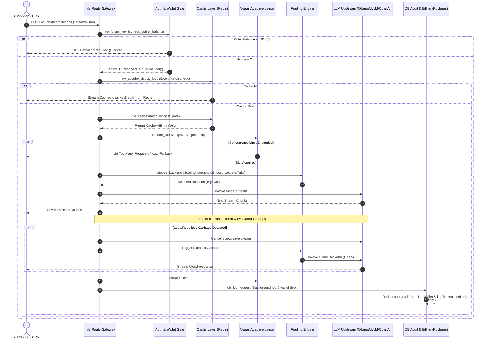

# 🏗️ InferRoute Gateway Request Lifecycle & Architecture

This document breaks down the internal architecture of **InferRoute** and traces a request step-by-step through the gateway pipeline.

---

## 🔄 Request Lifecycle Diagram

The following diagram illustrates the path of a client request (e.g. from an SDK calling `/v1/chat/completions`) as it flows through the gateway gates:

---

## 🛠️ Key Architectural Components

### 1. Unified Authentication & Credit Enforcement ([auth.py](../inferroute/auth.py))
* Checks the client token against valid static API keys to resolve the tenant ID.
* Queries `UserWallet` in the database. If balance is $\le 0.0$, raises `402 Payment Required`.
* **Fail-Open Design**: If the database throws a connection error (e.g., PostgreSQL is offline), the gate logs a warning and permits the request to continue. This prioritizes business availability over strict credit locks.

### 2. Double-Cache Optimization Layer ([cache.py](../inferroute/cache.py))
* **Exact Deduplication Lock**: Avoids "Cache Stampede". If an identical prompt is already being processed by the gateway, the second request does not hit the upstream model. Instead, it subscribes to a Redis Pub/Sub channel associated with that prompt and streams the same response simultaneously.
* **Prefix-Affinity Cache Trie**: Uses a **Radix Trie` in `router_trie.py` to match the longest prefix of the incoming prompt. The matched prefix length is used to boost the score of the backend node holding that KV-cache, bypassing prefill computation.

### 3. Vegas Congestion Rate Limiter ([rate_limiter.py](../inferroute/rate_limiter.py))
* Tracks latency metrics dynamically using a feedback loop.
* Computes queue sizes based on the difference between the minimum RTT (`base_rtt`) and the moving average RTT.
* Auto-adjusts concurrency limits:
  * If queue size is low: `limit = limit + 1`
  * If queue size is high: `limit = max(1, limit - delta)` (multiplicative decrease).
  * Restricts incoming requests when limits are breached, shifting traffic to cloud fallbacks.

### 4. Smart Decision Router & Circuit Breakers ([router.py](../inferroute/router.py))
* Aggregates weights for cost, failure history, target SLO, circuit-breaker status, and KV-cache affinity.
* Computes a probability distribution using a softmax function or picks the highest-ranking candidate based on the active policy (`Speculative`, `Latency-First`, `Cost-First`, or `Load-Balanced`).
* Automatically switches to backup cloud providers if the primary node's circuit breaker enters the `OPEN` state.

### 5. Speculative Stream Quality Validator ([validator.py](../inferroute/validator.py))
* Inspects stream chunks as they are generated by cheap/local endpoints.
* Evaluates repetitive token loops (e.g. model output repeating the same phrase).
* If a loop or syntax error is identified, cancels the active stream asynchronously, blocks billing logging for the local failure, and opens a secondary cloud stream to transparently complete the request for the client.
