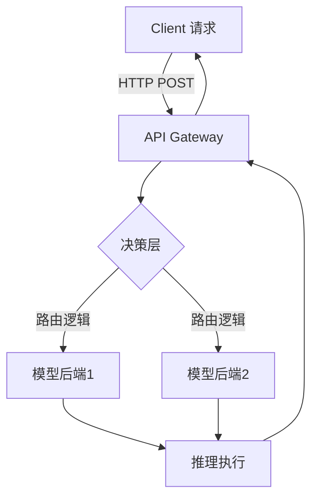

# InferRoute 项目规划报告（LLM 推理网关与控制平面）

## 执行摘要

InferRoute 是一个面向大规模语言模型（LLM）推理的网关系统，它为上层应用提供统一的 API 接入，并在多个模型提供商（如 OpenAI、Anthropic、Google 以及自托管开源模型）之间智能路由。设计该系统的主要动机在于 **解决多模型环境下的成本控制、可用性保障和性能优化问题**。如业内专家指出，LLM 网关（LLM Gateway/Proxy/Router）处于应用和底层模型之间，通过单一统一接口提供路由、治理和可观测性。通过集中化的网关，能够实现模型选择、负载均衡、故障切换、速率限制、成本跟踪等功能，将“对 LLM 的调用”转变为可管理、可审计、成本可控和与提供商无关的平台能力。  

为实现上述目标，InferRoute 将综合采用**多模型智能路由**策略，根据请求的任务类型、上下文长度、模型特性以及实时性能指标（如延迟、成本估计、可用性）来选择最合适的模型提供商。这样可以显著提高性能和降低成本。例如，通过将摘要任务路由到适合长上下文的模型（如 Claude），TrueFoundry 实验中观察到平均响应时间降低约 20%；而将简单任务路由到小型模型（如 Mixtral）可使耗费的令牌成本减少约 60–70%。综合这些策略，InferRoute 的目标是为多种下游应用场景（如智能客服、文档处理、代码生成、数据抽取等）提供高吞吐、低延迟、高可用且成本可控的 LLM 推理服务。  

本报告详细规划了 InferRoute 的目标、用户场景和成功指标，系统架构与数据流，高层路由策略与决策逻辑，关键功能列表（缓存、去重、超时、熔断、重试、降级、可观测性、计费估算、A/B 测试等），实现计划与技术栈建议（后端、数据库、缓存、监控、CI/CD、安全等），测试与基准评估方法（P50/P95/P99、吞吐、成本/请求、故障注入、混合负载），性能目标与基准数据建议，部署与运维策略（多区域、容灾、伸缩），最终交付物清单（README、架构图、API 文档、Demo、benchmark 脚本、可复现实验、监控仪表盘示例等），项目时间线与里程碑，代码组织与模块接口示例，以及示例 API 调用、README/Demo 编写准则和项目在简历/GitHub 上的呈现方式。设计方案以实用工程细节为主，引用了多种官方或权威资料，确保信息准确可靠，便于招聘经理/工程师评估该项目的技术价值和可行性。  

## 项目目标与动机

随着 AI 应用对 LLM 的需求爆发，多模型环境下的推理服务成为关键基础设施。传统的单一模型调用已无法满足复杂需求：模型提供商众多，API 形式多样；模型质量、延迟和计费方式差异显著；服务可用性和安全性要求更高。正如专家所指出，**LLM 网关**的出现正是为了解决这一类问题：它置于应用与模型提供商之间，通过统一接口隐藏多源复杂度，并负责路由、治理与可观测。具体来说，InferRoute 的目标包括：

- **多模型协同**：支持接入多种 LLM 后端（商业 API 与自部署），使应用无需修改调用逻辑即可灵活选择或动态切换模型。
- **智能路由决策**：基于任务特征和指标，将请求路由到最佳模型，以达到性能最优、成本最低。例如，将长文本摘要交给长上下文擅长的模型，将简单问答交给快速小模型。
- **可靠性和高可用**：网关负责自动故障检测与切换，将上游请求在主用模型提供商出现故障或超时情况下平滑切到备用模型。
- **成本可控**：提供 Token 计费和预算管理。通过限制高成本模型的使用（例如超出预算则降级到低成本模型）来控制整体费用。
- **治理与合规**：集中执行访问控制、速率限制、策略过滤等，简化安全审计和合规检查。
- **可观测性**：全链路记录请求的路由决策、模型调用延迟、错误率、Token 用量和成本指标，帮助团队实时监控和优化。
- **可扩展性和可拓展性**：设计为云原生架构（可部署在 Kubernetes 等平台上），支持横向扩展，并易于集成新模型和自定义策略。

成功建成 InferRoute，将为开发者和企业提供一个企业级的 AI 控制平面，使得 LLM 调用从“零散的API调用”上升为“可管控、可度量、可扩展”的基础服务。这也符合业界给出的部署策略：先实现调用可视化和密钥管理，再逐步添加成本控制和路由故障机制，最终优化缓存和性能路由。

## 目标用户与使用场景

InferRoute 面向希望大规模使用 LLM 的公司和开发团队，其典型用户包括 AI 应用开发者、平台团队和 SRE。主要使用场景包括：

- **多模型应用**：应用场景需要利用多个模型互补优势，如对话助手将复杂问题路由给 GPT-4，长文档摘要使用 Claude，简单查询使用 Mixtral 等。InferRoute 帮助集中管理这些模型，一键在应用内切换，降低开发复杂度。
- **任务导向服务**：面向不同业务任务（摘要、分类、代码生成、实体抽取、创意写作等）的智能服务，通过路由策略自动选择最合适模型。例如客服系统自动识别工单类型后选择不同模型处理，提升性能与准确率。
- **成本敏感的高并发服务**：对于大批量调用场景（如批量文档处理、信息抽取任务），InferRoute 可将高吞吐需求导向廉价模型或本地部署模型，以大幅降低云API成本，同时通过路由规则保证响应质量。
- **多环境切换与灰度测试**：开发者可以通过 API 标头或路由配置，将部分流量导向新模型版本或灰度环境进行 A/B 测试，实时评估新模型表现。例如传递自定义标头 (如 `X-LLM-Test-Version`) 来启用测试流量。
- **运维与监控团队**：作为 AI 控制平面，运维团队可通过 InferRoute 获取统一监控视图，包括每个模型后端的延迟、错误率和成本使用情况，便于进行容量规划和故障响应。

在这些场景下，InferRoute 作为一个集中的推理网关与控制平面，将简化后端模型管理、提高系统稳定性，并通过智能路由和监控帮助业务达成性能与成本目标。TrueFoundry 的案例显示，任务型路由和多模型管理能显著提升 ROI：将摘要任务路由到 Claude 可减少 20% 平均延迟，将简单查询路由到 Mixtral 可减少 60-70% 成本，说明路由逻辑对业务影响巨大。

## 成功指标（SLO/SLI）

为衡量 InferRoute 的质量与效果，我们应建立明确的服务级目标（SLO）和可观测指标（SLI）：

- **延迟指标**：关注首字延迟（Time to First Token, TTFT）和全响应延迟。目标例如**TTFT p50 < 200ms，p95 < 500ms**。根据分析报告，p50 延迟常被夸大，而企业生产环境更关心 p95/p99 延迟。理想情况下，以毫秒级响应为目标，确保大部分请求响应迅速且尾部延迟可控。TTFT直接影响交互体验，而 p95/p99 反映系统在高负载或复杂请求时的表现。
- **吞吐量**：系统需支持的并发请求量和令牌吞吐。目标要能处理目标场景下的峰值流量（如百级或千级 QPS）而不显著降级。吞吐衡量模型在单位时间内生成的令牌数，好的设计需兼顾高并发请求和单请求吞吐。
- **可用性/容错**：例如**99.9%** 服务可用性。通过故障转移与重试机制确保在任一模型后端不可用时仍能服务。SLI 可监控接口成功率、错误率，目标将错误率严格控制在可接受范围内（如 <0.1%）。
- **成本控制**：以**每请求或每千令牌成本**计量。目标根据预算设定，例如每千令牌成本不超过 0.01 美元。路由策略应根据成本预算自动调整模型选择。
- **缓存命中率**：如果实现 KV 缓存，可衡量缓存命中率和重用比例，以反映性能优化效果。
- **观察指标**：包括 API 请求速率（TPS）、后端模型调用时延分布（p50/p95/p99）、模型错误率、Token 使用数、成本累积等。所有决策点和关键事件（路由选择、模型切换）都需记录日志和追踪，以便诊断和分析。
- **其他指标**：如模型健康状态检测周期、重试次数、缓存状态分布等。

SLO 设定应依据实际业务场景。例如，对于实时对话应用，TTFT p99 建议小于 1s；对于批处理任务，可接受较高延迟，但吞吐需足够。总之，设计时需格外关注尾部延迟和成本/性能的平衡。

## 系统架构与数据流

InferRoute 采用云原生架构，包括**控制平面（Control Plane）**和**数据平面（Data Plane）**两个层次。如 AIBrix 等系统所示，控制平面负责模型元数据管理、策略配置、自动伸缩等，数据平面负责请求分发、负载调度和模型推理执行。总体架构图如下：

 *图：InferRoute 系统架构示意。系统分为前端 Gateway、控制面组件和后端推理引擎。数据流：客户端请求首先进入统一 API Gateway 进行预处理和鉴权，然后由路由器根据策略选择模型后端并分发请求，推理结果通过网关返回客户端。*

- **API Gateway**：对外提供 OpenAI 兼容的统一接口（RESTful）。负责认证鉴权、请求限流、日志采集等。客户端无需感知后端差异，只调用该网关的单一端点。
- **请求路由器（Router）**：核心组件，依据配置的路由策略和实时指标决定将请求发送至哪个后端（包括 OpenAI、Google、Anthropic API，或本地部署的 vLLM/DynamoPod 等）。路由器可具有**缓存感知**功能（避免对已预置缓存的相同前缀再计算）、**会话关联**策略（同一会话请求倾向路由到缓存存在的 Pod）、以及**多阶段支持**（对预填充/生成分离部署做分段路由）。
- **模型后端**：实际执行推理的组件。可包括第三方 API 适配层（调用外部商用模型），也可是集群化的自托管引擎（如 vLLM, llama.cpp 等）。每个后端节点可能带有运行时代理（侧车），用于监控状态、上报资源使用、执行请求等。
- **控制平面服务**：包括模型注册/目录服务、路由规则管理界面、监控指标采集与告警、以及模型自动伸缩器（AutoScaler）等。配置界面允许运维人员定义任务类别、成本预算、SLO 阈值等路由规则。控制平面持续监测各模型健康状况和延迟性能，当检测到异常时可以更新路由或触发熔断。
- **分布式 KV 缓存**：为提高效率，可设计一个分布式 KV 缓存层，存储最近请求的 KV 缓存（Transformer 前向过程中产生的中间状态）。路由器可以查询缓存状态，优先选择已缓存相同前缀的节点，从而显著减少重复计算。
- **数据库/存储**：用于保存持久化信息，如模型元数据、路由规则、使用记录、审计日志和前端请求日志。常用关系型数据库（如 PostgreSQL）存储配置和元数据，NoSQL 存储监控数据和日志。
- **监控和日志系统**：使用 Prometheus/Grafana 等工具收集各组件指标（TPS、延迟、错误率、利用率）和链路跟踪日志（可以使用 OpenTelemetry）。
- **消息队列（可选）**：为实现异步处理或确保可靠投递，可引入 Kafka/RabbitMQ 等队列，比如用于内部事件（故障通知、指标更新）或批量推理任务。
- **接口/API 文档**：提供 Swagger/OpenAPI 文档描述网关接口格式、参数说明和示例响应，便于用户使用和二次开发。

以上架构参考了 AIBrix 等开源控制平面（见图和 AIBrix 文档），并结合 LLM 推理特点进行优化。如图所示，控制平面和数据平面协同工作，控制面定义策略和模型图谱，数据面执行请求分发，并通过分布式缓存和并行负载均衡来提升效率。组件之间通过轻量消息和 REST 接口通信，并可容错部署。整体数据流：前端网关接收请求→鉴权限流→Router 读路由配置→根据任务类型/预算/实时状态决策→调用选定后端→后端执行推理→结果返回（顺带计量成本并上报监控）。

## 路由决策逻辑与策略

InferRoute 的核心价值在于**智能路由决策**，它综合考虑请求特征和系统指标以最大化性能、成本效益和可用性。主要路由依据包括：

- **任务类型路由**：根据请求意图或任务类别（如摘要、分类、编程、实体抽取、创意写作等）将请求定向到最匹配模型。例如，生成性推理和代码相关任务可优先使用 GPT-4 类模型，而长文档摘要使用长上下文模型 Claude，批量标签和简单问答使用快速小型模型。TrueFoundry 建议为每种意图配置合适的模型组合，以优化效果和成本。
- **上下文长度与成本**：对于输入长度很长的请求，优先考虑支持长上下文的模型。可在路由中设定 Token 预算阈值：如预计令牌使用成本过高，则自动将请求从高成本模型（如 GPT-4）切换到低成本模型（如 Mixtral）。同样可以设置延迟阈值：对延迟敏感的流量（实时对话）设定最大延迟，上限满足不了时切换到更快模型。
- **实时性能与健康状况**：路由器持续监控各后端的平均延迟、错误率和健康状况。若主用模型出现超时或错误，系统会基于配置的故障恢复策略立即降级到备用模型。TrueFoundry 的动态路由特性允许在每次请求前评估实时指标，满足某些“守护规则”后才发送到首选模型，否则回退到备用。
- **负载均衡**：对具有相同能力的模型后端，采用平衡算法（如加权轮询、最少连接、延迟打分等）分摊流量。与传统负载均衡不同，LLM 路由需要考虑 KV 缓存分布和硬件差异，避免简单轮询导致性能抖动。
- **缓存感知调度**：查询或聊天会话通常具有上下文前缀。如果同一前缀已在某个后端节点生成过，可以重用该节点的 KV 缓存，以极低代价完成响应。因此，路由器可维护一个 **数据层** 状态（如哪个 Pod 拥有哪些缓存块），在 **决策层** 中优先选择缓存命中的节点。这可将相同请求的延迟从秒级降到毫秒级。
- **会话亲和性**：对于多轮对话，保证用户的连续请求落在同一后端节点，以保留 KV 缓存的连续性。这类似传统的会话黏性，但针对 LLM 的缓存状态尤为关键，可显著提升每轮响应速度。
- **多阶段执行路由**：如果后端部署了“预填充/推理分离”（Prefill/Decode Disaggregation），路由需分两个步骤完成：先将请求发给预填充节点生成 KV 缓存，再将结果转发给解码节点进行生成。执行层协调这两步，实现端到端响应。路由器框架应支持定义多步骤路由策略，而非仅单次转发。
- **灰度与测试路由**：路由器支持基于请求标头或版本标签的流量切分，用于 A/B 测试或灰度发布。例如，带有特定标头的请求可定向到实验模型，其他请求按常规路由。
- **会话/租户隔离**：根据域名、路径或用户 ID 进行域级路由，将不同客户或项目的流量隔离开，确保安全和资源划分。
- **流量优先级**：可为不同的流量类别配置优先级。高优先级流量（如关键对话）可获得更严格的 SLO 和资源，而低优先级流量可在高负载时使用廉价模型。
- **学习和优化**：路由策略可以基于历史数据不断调整，例如分析不同模型在各类任务上的成功率或延迟分布，自动优化模型选择。监控到趋势变化时（如某模型老化），可以自动下线该模型或减少权重。

下表总结了常见路由策略的特点对比：  

| 路由策略            | 基础方法               | 特点/应用场景                                   |
| ------------------- | ---------------------- | ------------------------------------------ |
| 固定加权轮询        | 按权重循环分配流量       | 简单稳定，适用于负载均衡，但不考虑请求差异       |
| 负载感知            | 最少连接、最小延迟      | 优先低延迟后端，提高吞吐；不考虑缓存或任务类型    |
| 成本/延迟阈值路由   | 基于预算和延迟阈值决策   | 灵活可控，超预算或超时自动切换低成本/低延迟模型 |
| 任务/意图路由       | 根据任务标签或元数据路由 | 不同任务使用专门模型，提高结果质量和成本效率     |
| 缓存感知路由        | 优先缓存命中节点       | 减少重复计算，显著降低延迟       |
| 会话黏性            | 基于用户/会话标识固定路由 | 保持上下文连续性，适用于对话场景   |
| 混合路由（多层）    | 组合以上策略           | 通常结合任务路由+性能阈值+健康检查，实现多维度优化 |

正如 Modular 公司所提倡的，现代 LLM 路由架构分为**数据层、决策层和执行层**。数据层（如缓存状态）须在微秒级更新查询；决策层将多种策略逻辑组合测试；执行层则负责多步骤协调（例如支持分离的预填充与解码流程）。采用这种分层设计可以使路由规则可测试、可复用，并适配各种部署场景。

## 关键功能清单

为了实现上述路由策略和系统目标，InferRoute 需要具备一系列核心功能：

- **分布式 KV 缓存**：存储最近会话的 transformer KV 缓存，允许后续前缀相同的请求快速填充。通过全局或按节点共享的缓存（如 Redis、memcached 或自研方案），大幅减少重复计算。
- **请求去重**：对于并发到来的相同请求，可识别并只执行一次推理，将结果共享给所有等待客户端，避免重复消耗资源。
- **超时预算**：对每个请求分配超时时间预算，避免单次调用阻塞过久。超时后可中断请求并进行重试或切换备用模型，以提高稳定性。
- **熔断与重试**：实时监测后端错误率和延迟。若某模型连续失败或超时达到阈值，熔断器将短暂禁用该模型并将流量重路由到其他模型。遇到临时故障时还可自动重试并退避（如指数退避）以平滑故障影响。
- **降级模式**：在系统过载或部分后端不可用时，自动将高资源任务降级到低精度模型或本地轻量化模型上，以保证可用性。比如在网络连通性不好时切换到本地模型，或紧急时停用缓存以腾出资源。
- **访问控制与密钥管理**：支持多租户API密钥管理、请求来源鉴权和限流。可为不同租户配置不同的配额和优先级，并在控制台集中管理密钥权限。
- **速率限制**：基于令牌桶等算法，对外部请求总量或单模型调用频率做限制，防止流量突增导致过载。
- **路由策略管理界面**：提供动态配置路由规则的界面或 API，包括基于任务标签、延迟阈值、成本预算的规则设置。运营人员可在线修改策略，无需重启服务。
- **负载均衡**：对相同模型的多实例进行健康检查和流量分发，保持集群内负载均匀。可支持权重调节，以逐步上线/下线模型实例。
- **监控与可观测性**：集成链路跟踪系统（如 OpenTelemetry），记录每次请求的路由决策和每层调用的延迟。关键事件（例如模型切换、熔断触发）均写入日志。提供实时指标（每模型的延迟分布、错误率、使用量、成本）。通过监控界面和告警确保问题及时发现。表明网关持续监测每个提供者的性能，并记录成本和错误以触发故障恢复。
- **成本/计费估算**：在调度前评估请求的预估令牌使用量，并结合各模型的计价策略估算成本。可在路由规则中基于预算阈值决策，也可输出成本报告（如每个请求消耗多少美金）。
- **A/B 测试与灰度发布**：支持流量拆分策略，实现新模型或新策略的灰度发布。可配置按比例路由一部分请求到试验模型，并提供对比指标。TrueFoundry 即使用请求头（如 `X-LLM-Test-Version`）实现了版本切换和流量验证。
- **扩展插件机制**：允许插入自定义路由器插件（例如自定义 scorer、策略过滤器或自研模型）。模块化设计使得新策略或后端引擎可以插拔式集成。
- **指标限速与熔断指标**：支持每个模型 TPS（每分钟调用数）、TPM（每分钟令牌数）等指标限制，以实现业务级别的服务质量控制。
- **身份验证与审计**：集成企业单点登录、LDAP、OAuth 等认证方案；记录谁在何时调用了哪些模型和策略，用于审计合规。

以上功能集合保证了 InferRoute 不仅仅是一个代理层，更是一个面向 LLM 的**服务质量控制平面**。例如 Adnan Masood 提到，LLM 网关的任务包括负载均衡、率限制、成本跟踪、策略执行、日志审计等。InferRoute 聚合这些能力，打造一个可靠、可控、面向生产的推理平台。

## 实现计划与技术栈建议

### 技术栈

- **后端服务**：建议使用高性能网络框架，如 Python 的 FastAPI 或 Node.js 的 Express/Koa（若偏好 JS）来实现网关和路由逻辑。FastAPI 具有异步特性，适合高并发场景。
- **数据库**：使用 PostgreSQL 等关系型数据库存储元数据（模型目录、路由规则、审计日志），并可使用 TimescaleDB 扩展存储时序数据。也可结合 Redis 等键值库存缓存和快速查找。
- **缓存**：采用 Redis/Memcached 构建分布式缓存层，存储 KV 缓存和路由决策状态。Redis 可用于限流计数、会话粘贴等。
- **消息队列**：如需处理异步任务（批量推理、事件通知），可以引入 RabbitMQ 或 Kafka。
- **容器与编排**：使用 Docker 容器化应用，并在 Kubernetes 上部署。Kubernetes 支持滚动更新、自动伸缩、健康检查等，非常适合本项目。可利用现有 KServe/Inferentia 等生态。
- **监控与日志**：采集应用日志（ELK/EFK）、指标（Prometheus + Grafana）、链路追踪（Jaeger/OpenTelemetry）。利用 Grafana 仪表盘展示模型性能和成本趋势。
- **API 文档**：使用 Swagger/OpenAPI 自动生成接口文档。便于用户阅读和前端校验。
- **CI/CD**：使用 GitHub Actions 或 Jenkins 管道实现自动测试、构建和部署。构建镜像后可自动推送到 Docker Registry 并在测试环境部署。实现单元测试和集成测试的自动运行，确保代码质量。
- **安全**：网关启用 HTTPS/TLS 加密。API 请求带有签名或 Token 验证。敏感配置（API 密钥、密码）使用 Vault/AWS Secrets Manager 等集中管理。遵循最小权限原则，监测异常流量和潜在攻击（可结合 WAF）。

### 实现步骤

1. **需求分析与设计（第1周）**：明确项目功能清单，确定关键 SLO。根据使用场景细化路由策略、缓存与故障处理机制。绘制系统架构草图并选定技术栈。  
2. **原型搭建（第2周）**：在本地环境下启动一个简单的 FastAPI 服务作为网关框架，实现调用单一模型后端（如 OpenAI API）。验证基本请求转发和响应返回。编写基本单元测试。  
3. **多模型接入（第3周）**：扩展原型，支持同时调用多个模型提供商（OpenAI、Anthropic 等）。实现模型目录和简单轮询路由，测试不同模型响应。  
4. **路由逻辑开发（第4周）**：引入任务路由的逻辑分发。实现基于请求元数据（如自定义 Header 指明任务类型）或规则引擎的模型选择。实现延迟/成本阈值控制，初步支持故障切换与重试。  
5. **缓存与会话（第5周）**：集成 Redis，设计前缀缓存机制。实现 KV 缓存查询和更新，确保路由器能优先选择缓存命中节点。实现会话黏性（Sticky Session）策略，减少跨节点上下文丢失。  
6. **高级特性（第6周）**：添加超时预算、熔断器、动态速率限制等功能。实现详细监控埋点，集成 Prometheus 导出指标、Jaeger 链路。提供控制面简单 UI/API 来设置路由规则、查看统计。  
7. **测试与性能优化（第7周）**：编写压力测试脚本（使用 k6/locust 等）模拟真实负载。收集 p50/p95/p99 延迟数据，识别瓶颈并优化（如异步化、连接池、前置缓存等）。确保在并发激增时表现稳定。  
8. **部署与文档（第8周）**：完善部署脚本和 Kubernetes 配置（包括多区镜像、自动伸缩设置）。撰写 README、架构图、API 文档和使用示例。准备演示环境和测试套件。  
9. **演示和迭代（第9周）**：使用示例应用（如聊天机器人或知识库问答）进行集成演示。根据反馈微调策略。补充缺失的边界测试，如模型限流下fallback、网络故障恢复等。  
10. **交付与发布（第10周）**：整理所有成果，发布到 GitHub。包括代码库、文档、示例和基准报告等。编写一份演示视频或演示笔记。最后撰写技术报告或博客，提升项目影响力。

**团队建议**：1-3 人开发，跨职能（后端开发、DevOps、测试）。总体迭代周期可安排 8-12 周，根据需求复杂度和人力调整。  

## 测试与基准评估方法

为了验证系统性能、稳定性和准确性，需要设计严谨的测试方案：

- **负载测试**：使用工具（如 [k6](https://k6.io/)、[Locust](https://locust.io/)、[Vegeta](https://github.com/tsenart/vegeta)）在真实请求模式下压测。在负载测试脚本中模拟实际流量分布：并发用户数（50–200+）、请求速率、提示长度分布等。测试时记录各模型后端的 TTFT、生成吞吐、总延迟（TTFT + 解码时间）、系统总体吞吐和资源使用。  
- **尾延迟观测**：重点收集 p50、p95、p99 等百分位延迟数据。确保在高并发和复杂请求场景下，p99 延迟在可接受范围内。关注“P99 问题”，即尾部异常导致的用户体验下降。  
- **成本评估**：对比不同路由策略下单位时间内消耗的 Token 数和实际成本。模拟多种场景（全使用高端模型 vs 智能路由），评估成本节约效果。使用云供应商的计费 API 或第三方工具测量每千令牌花费，验证是否满足预算目标。  
- **故障注入测试**：模拟模型后端故障（如 API 超时、错误频率上升），观察路由器是否按预期进行熔断和降级。可用 [Chaos Engineering](https://chaosengineering.io) 方法，在测试环境故意让某个后端宕机，验证系统能否无缝切换到备用模型而不中断服务。  
- **混合负载**：同时生成短提示和长提示、简单任务与复杂任务混合的流量，测试路由策略的稳健性。检查系统在高负载下是否能根据设置的策略正确分流，并评估资源利用率。  
- **单元与集成测试**：编写单元测试覆盖路由决策逻辑、缓存行为、数据库访问等。集成测试可模拟完整请求流，验证网关与各后端的交互。对异常场景（如超时、响应错误）进行测试，确保正确触发重试和降级逻辑。  
- **基准指标对标**：参考独立基准测试报告了解不同模型提供商或硬件的性能特性，将 InferRoute 在相同条件下的结果与之对比。比如用 [Artificial Analysis](https://artificialanalysis.ai) 等工具对几种模型进行测试，校准自己的负载生成器的准确度。  
- **监控数据分析**：在测试过程中收集 Prometheus 数据，可在 Grafana 中绘制 p50/p95 延迟曲线、吞吐随并发变化曲线、Token 使用率和成本图表，辅助发现性能瓶颈和调优方向。

注重从用户体验角度评估：**TTFT（首字延迟）是聊天交互体验关键**，**p95 和 p99 决定大规模服务质量**。测试结果应明确响应时间分布，以及不同策略下的成本消耗。根据 [GMI Cloud 报告](https://www.gmicloud.ai)，真实负载下的 p95 往往远超营销指标，应确保在用户量激增时也能保持稳定性能。

## 性能目标与基准建议

基于上述测试方法，初步的性能目标可以参考行业实践并结合资源规模设定：

- **延迟目标**：对于典型提示（100–500 token），尝试将 TTFT p50 控制在 100–200ms，p95 控制在 400–500ms 以下，p99 不超过 1 秒。对于长上下文请求（1000+ token），容忍更高延迟，但应保证 p95 < 2s，否则可考虑拆分或异步策略。
- **吞吐目标**：针对小模型后端，目标例如单节点能支持数百 QPS；整个系统（多模型并行）在硬件允许下达到上千 QPS。通过缓存和多模型路由，尽量提高整体吞吐。
- **成本基准**：每千输入+输出令牌成本低于 $0.01（具体依据云厂商定价）。路由策略应将成本高的模型使用量限制在预算内。可参照人工分析（ArtificialAnalysis）或 MLPerf 等公开数据来大致估算不同模型的每令牌成本。  
- **可靠性指标**：在完全正常状态下，系统可用性目标为 ≥99.9%。在单个模型故障时仍能满足基础服务（降级可用），并在几秒级别完成故障切换。
- **环境基准**：在开发环境和生产环境应运行相同的测试套件，确保延迟和吞吐指标在不同环境一致。在多区域部署时，对比不同机房/云区的延迟差异，优化部署策略（如靠近用户端部署、利用就近实例）。

具体数值须根据实际资源（GPU 型号、网络带宽等）和业务需求微调。上面目标仅供参考，测试时应记录**p50、p95、p99** 等关键统计并与目标对齐。

## 部署与运维

- **多区域部署**：建议支持跨多个可用区或地区部署，使用全球负载均衡（如AWS Global Accelerator、GCP Traffic Director）来路由用户请求到最近的区域。每区内部署完整的 InferRoute 服务集群和模型后端实例，实现容灾。跨区可用数据库或异步复制配置确保数据一致性。
- **自动伸缩**：利用 Kubernetes 的 **Horizontal Pod Autoscaler（HPA）** 和自定义指标（如 CPU、内存、后端队列长度、请求延迟）自动扩缩容。针对 LLM 特性，可采用自定义滑动窗口指标来实时调整副本数。
- **模型伸缩**：控制平面可以动态在 Kubernetes 中扩容后端模型副本（考虑模型加载时间较长，应预判负载变化）。可以结合 [AIBrix Autoscaler](https://aibrix.readthedocs.io/latest/designs/autoscaling.html)理念，使用 LLM 特定指标来更快地调整容量。
- **故障恢复**：设计应用故障恢复流程：如果主节点或区域失效，备份节点立即接管。数据库需要多副本、定期备份。关键组件使用 StatefulSet + PVC 或者外部托管数据库以保证持久性。
- **监控告警**：建立完善的监控告警规则，当延迟或错误率超阈值时自动通知开发团队。例如在 Prometheus 中对 TTFT p95、错误率等设置阈值警报。
- **运维工具**：提供运维命令行或控制台操作，如手动触发模型 reload、更新路由配置、清空缓存等操作。所有操作都应记录审计日志。
- **安全与合规**：确保通信加密（TLS）和端点鉴权。按需集成审计工具跟踪敏感操作。利用云平台安全组与网络隔离策略限制访问。

综合而言，部署时要兼顾**性能优化**（靠近 GPU、利用高速缓存）和**弹性保障**（多副本、多区域、自动伸缩）。

## 最终交付物

InferRoute 项目完成后，应交付以下成果，以便评估者快速理解和运行系统：

- **完整代码仓库**：包含后端服务代码、脚本、配置文件、示例数据。应按模块组织，并带有 README 指引。
- **架构图**：系统架构图（如上图）应被整理并放入文档，说明各组件之间的关系和数据流。
- **API 文档**：使用 Swagger/OpenAPI 自动生成接口文档，描述网关提供的所有 API 端点、参数和示例请求/响应。
- **设计文档**：详细介绍系统各部分设计，包括路由策略决策流程图、缓存逻辑说明、数据库设计等。可使用 MerMaid 等绘制流程图和拓扑图嵌入文档中。
- **示例代码/演示**：提供示例应用（例如基于聊天或文档处理的 Demo）展示如何调用 InferRoute API，以及多模型路由效果。此示例应简单明了，配以注释和运行指南。
- **基准测试脚本**：包含负载测试脚本和数据生成工具，用于复现测试结果。可在 README 中说明如何使用 k6/locust 运行测试。
- **实验结果报告**：记录关键的性能指标（p50/p95/p99 延迟、吞吐、成本等），可附上图表或数据表格展示。
- **监控仪表盘样例**：若有条件，可提供 Grafana 仪表盘的截图或 JSON 文件，展示系统指标的监控界面示例，如各模型的延迟和错误率趋势图。
- **部署指南**：详细步骤说明如何在 Kubernetes（或其他环境）部署 InferRoute，包括创建服务、配置 Ingress、安装依赖等。
- **开发者文档**：指导开发者如何参与二次开发和扩展，包括接口说明、模块划分、贡献指南等。

例如，一个高质量的开源项目 README 通常会包含“项目简介、安装使用指南、架构图示例、功能列表、示例代码、许可证和贡献指南”等内容。我们应借鉴优秀项目的经验，将这些元素整合进去：在 README 顶部放置项目徽标和简要描述，接着快速开始指南和架构总览，在“功能”或“设计”章节中展示关键路由算法和决策流程的可视化图表。同时提供若干代码示例，帮助使用者快速上手。如同示例项目所示，一个好的文档中往往含有架构示意图、代码片段和演示动画，以提高可读性。在项目主页上可以附上 CI/CD 状态徽章、覆盖率徽章，增加项目可信度。

总之，交付物应包括 **完整源代码、文档说明、示例/演示和基准结果**，并组织良好，便于任何评估者克隆、部署和测试这个项目。

## 时间线与里程碑

以下为一个示例的 10 周迭代计划表（1-2 人团队），展示每周主要任务和交付成果：  

| 周次 | 主要任务                           | 预期交付成果                                 |
| ---- | ---------------------------------- | -------------------------------------------- |
| 1    | 需求分析、总体设计、技术选型         | 系统架构图、功能列表、技术方案文档            |
| 2    | 建立基础 API 网关原型（单模型）      | 可运行的基本网关服务代码、单元测试            |
| 3    | 接入多模型后端，模型目录配置         | 支持多个模型的路由原型、配置示例              |
| 4    | 实现任务型路由和性能阈值策略         | 路由决策模块、阈值触发逻辑                    |
| 5    | 集成分布式缓存，支持 KV 缓存         | 缓存组件集成、缓存命中示例、前缀缓存验证      |
| 6    | 熔断器、重试机制和监控埋点           | 熔断器实现、重试逻辑、Prometheus 监控指标埋点 |
| 7    | 压力测试与优化                       | 负载测试脚本、性能调优报告                    |
| 8    | 部署自动化与多区域部署测试           | Kubernetes 配置、自动化部署脚本              |
| 9    | Demo 演示应用集成与用户文档编写       | 示例应用代码、API 文档、使用手册             |
| 10   | 收尾、代码评审、发布准备             | 完整项目发布版、演示视频或录制演示           |

根据实际情况，可在每个阶段后进行评审和迭代修正。团队人数若更多，可并行进行后端开发和文档工作。重要里程碑包括：基本路由原型完成（第4周末）、缓存功能完善（第5周末）、性能达标（第7周末）、全功能 Demo （第9周末）。这样可以在有限时间内逐步递增系统能力，并及时发现问题。

## 代码组织与模块接口示例

InferRoute 的代码库建议采用模块化结构，如下示例：  

- `app/`：主应用入口，FastAPI 应用初始化、路由声明。  
- `controllers/`：请求处理逻辑，如调用后端模型、融合前后端逻辑。  
- `router/`：路由决策引擎实现，包含多种策略（权重轮询、缓存优先、阈值控制等）的插件。  
- `models/`：模型元数据定义（模型名称、提供商、参数、资源限额）。  
- `cache/`：缓存层封装，用于存储 KV 缓存和会话信息。  
- `db/`：数据访问层，如连接数据库查询路由规则、使用记录等。  
- `monitoring/`：指标上报和日志工具（Prometheus、OpenTelemetry 集成）。  
- `config/`：配置文件和路由规则定义（可支持 YAML/JSON 格式）。  
- `tests/`：单元和集成测试用例。  

示例模块接口（Python 风格）：  
```python
class InferRouter:
    def __init__(self, config: RouterConfig):
        # 初始化路由器，加载策略和模型列表
        ...
    def route_request(self, request: LLMRequest) -> LLMResponse:
        # 核心方法：根据请求（包含 prompt, metadata, user_id 等）和当前状态（延迟、缓存等）决定哪个模型调用
        ...
```
```python
class ModelBackend:
    def __init__(self, name: str, api_key: str, endpoint: str, model_id: str):
        # 每个后端服务的接口封装
        ...
    def infer(self, prompt: str, **kwargs) -> InferenceResult:
        # 调用后端模型 API 或本地推理引擎，返回生成结果
        ...
```
```python
class CacheManager:
    def get_cached_prefix(self, prompt_hash: str) -> Optional[CachedState]:
        # 查询是否存在对应前缀的 KV 缓存
        ...
    def store_cache(self, prompt_hash: str, kv_state: CachedState):
        # 存储生成后的 KV 缓存
        ...
```
```python
class CircuitBreaker:
    def __init__(self, failure_threshold: int, recovery_time: float):
        # 熔断器参数
    def call(self, func, *args, **kwargs):
        # 包装模型调用，统计失败次数，超阈值时阻止调用并触发熔断
        ...
```
这些示例说明模块边界和接口职责。各模块应有清晰的输入输出文档，方便测试和扩展。

## 示例 API 请求/响应

InferRoute 对外提供类 OpenAI 的接口，示例调用格式：  

**请求示例**：  
```
POST /v1/chat/completions
Headers:
  Authorization: Bearer {API_KEY}
  Content-Type: application/json
Body:
{
  "model": "gpt-4",
  "messages": [{"role": "user", "content": "请将以下中文摘要翻译成英文：..."}],
  "user_id": "user123"
}
```  

**示例响应**：  
```json
{
  "id": "infRouteResp1",
  "model": "gpt-4",
  "choices": [
    {
      "index": 0,
      "message": {"role": "assistant", "content": "Translated summary..."},
      "finish_reason": "stop"
    }
  ],
  "usage": {
    "prompt_tokens": 50,
    "completion_tokens": 20,
    "total_tokens": 70
  }
}
```  
在请求中可附带自定义 Header（例如 `X-Task-Type: "translation"` 或 `X-LLM-Test-Version`）以指示特殊路由要求。响应中 `usage` 字段报告了消耗的令牌数，可用于成本计算。若发生故障切换，返回的 `model` 字段会标记实际使用的后端（如 `"Mixtral-Instruct"`），同时可在响应中额外提供原路由决策和时间戳等调试信息（通过调试模式开关）。

## README 与示例演示最佳实践

项目的 README 和 Demo 应充分展示系统的价值和易用性。参考优秀仓库的做法，README 应包括：项目简介、架构图、特性列表、安装/使用步骤、代码示例、性能指标展示，以及贡献指南。**示例演示**（可用 Jupyter Notebook 或网页应用）应展示如何调用 InferRoute 接口以及路由效果，例如对同一输入分别使用不同模型的对比结果。架构图和流程图建议用 Mermaid 或 Visio 制作清晰展示，如下所示（使用 MerMaid 语法示意）：  

README 中应当附带该类示意图，配以文字说明，以帮助新用户快速理解。示例代码块应覆盖核心用例（如普通问答、长文本摘要、多模型对比）。并且，使用 Markdown 的清晰格式和缩进，保持段落简洁（每段 3-4 行），使用列表强调要点。同时，尽量在文档中提供实时可点击的“运行示例”（如使用 Binder 或 GitHub Codespaces）以增强吸引力。

## 简历/GitHub 展示

若将 InferRoute 项目放在简历或 GitHub 上，应突出项目的技术亮点和成果：  
- 强调 **项目规模和角色**：如“开发了一个支持多模型智能路由的 LLM 推理网关”。
- 指出 **主要功能实现**：例如“实现了基于任务类型和预算的动态路由策略、分布式 KV 缓存和故障转移机制”。
- 用 **量化指标** 来体现效果：如“通过路由优化，响应延迟降低 20%，推理成本减少 60%”。引用类似的数据可以帮助说明项目价值。
- 展示 **技术栈**：FastAPI, Redis, PostgreSQL, Kubernetes, Prometheus, Docker 等，表明熟悉工具链。
- 如果可能，提供链接到项目的 README, Demo 和架构图截图。在简历中使用简洁语言介绍项目目标和贡献；在 GitHub 项目首页用清晰易读的 README 说明整个系统架构和使用示例。比如写道：“在该项目中，我实现了一个企业级 LLM 路由平台，支持多模型负载均衡和智能降级，显著提升了服务的可靠性和性价比。”

通过上述方式，在简历和代码仓库中突出项目的工程实现细节和影响力，可以让招聘人员/评审快速理解并认可项目的技术深度和实用价值。

**参考文献：** 引用了多篇业内文章和开源项目资料，包括 LLM 网关设计原则、多模型路由案例、缓存和故障处理方案以及开源项目 README 编写指南等，以确保设计思路符合当前最佳实践。